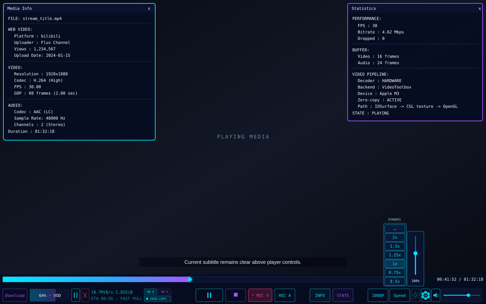
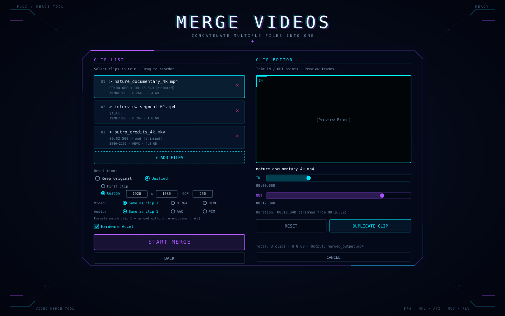
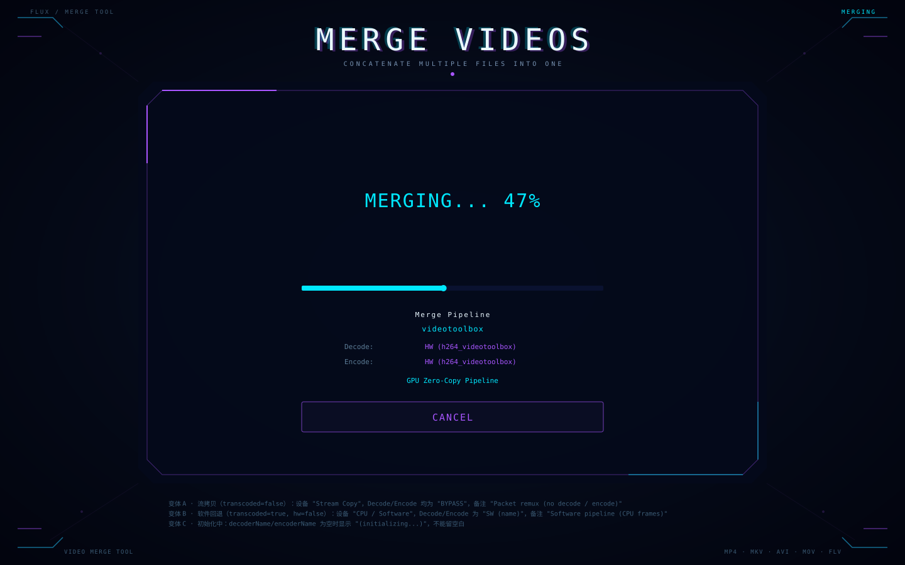
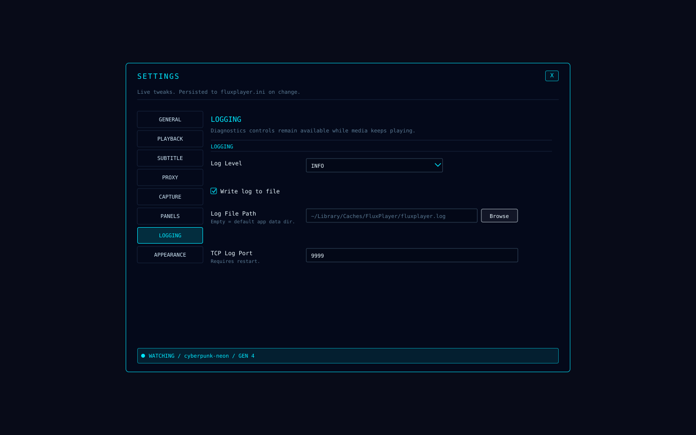
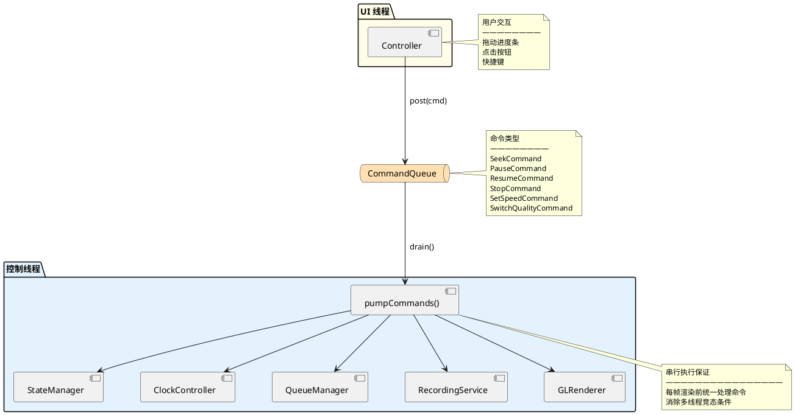
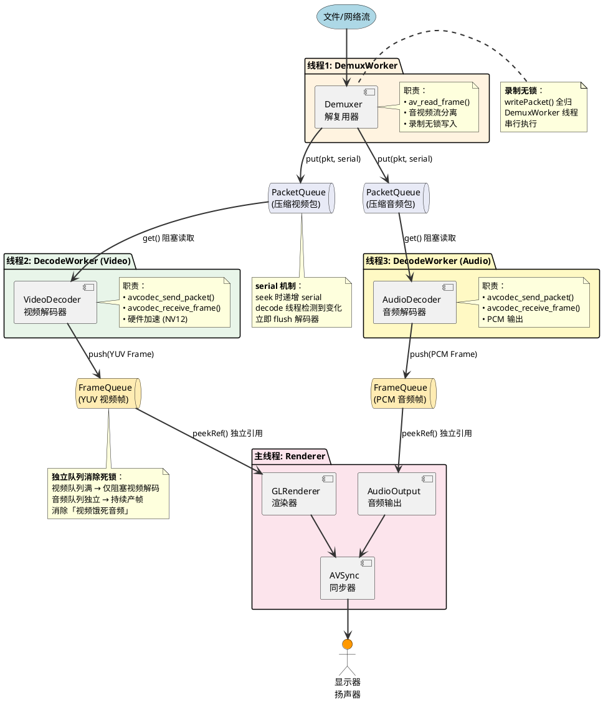

# FluxPlayer


<div align="center">
  
</div>


基于 FFmpeg + OpenGL 的跨平台桌面视频播放器：底层用 C++17 实现解码、渲染与业务管线，界面层用 Lua 5.4 皮肤脚本描述。覆盖 macOS / Windows / Linux 三端。从本地文件、纯音频，到 RTSP/RTMP/HTTP/HLS/DASH 网络流，再到 B站、YouTube 等 1000+ 平台的网页视频，都能直接打开播放。

核心能力包括：OpenGL YUV→RGB GPU 渲染与色彩空间自适应、Windows D3D11VA 与 macOS VideoToolbox 硬件解码及原生 GPU/OpenGL 零 CPU 拷贝互操作、自适应主时钟音视频同步、内嵌字幕解码渲染，以及截图（含 YUV/NV12 原始格式）、图片查看（JPG/PNG/YUV/NV12）、录像录音、多视频合并与片段截取、网页视频下载（断点续传）、画质切换、倍速播放等实用功能。

界面采用「皮肤描述 UI，C++ 提供引擎」的分层设计：Home、播放控制层、Merge、字幕、Toast 和设置面板都由 Lua 皮肤驱动，皮肤单文件同时定义语义 token、布局参数与可执行 Surface。C++ 侧由 **FluxUI** 抽象层把控件描述与具体绘制后端解耦，**SettingsSchema** 注册表以「键名 → 类型 + 读 + 写」的方式驱动设置项的渲染与落地——新增设置项只改注册表，绘制代码不动。

## 功能特性

- 🎬 支持主流视频格式（MP4、MKV、AVI、FLV、MOV 等）
- 🌐 支持网络流播放（RTSP、RTMP、HTTP、HLS）
- 🖥️ OpenGL YUV→RGB GPU 渲染，自适应 BT.601/BT.709/BT.2020 色彩空间 + TV/PC 量化范围
- 🔊 跨平台音频输出（macOS AudioToolbox / Windows WinMM / Linux ALSA）
- 🎛️ Lua 皮肤驱动的控制界面（播放控制、进度条、音量、媒体信息、统计面板、设置面板）
- 📂 支持文件拖放打开
- ⏱️ 音视频同步（自适应主时钟：有音频用音频时钟、无音频退回外部时钟），音频时钟回调间隙实时插值消除阶梯跳变
- 🚀 FFmpeg 多线程解码；软件 YUV420P 帧跳过不必要的 sws_scale 后直接上传 OpenGL
- ⚡ 硬件加速解码（macOS VideoToolbox / Windows D3D11VA），默认开启；原生互操作不可用时在播放线程启动前重建为软件解码器
- 🎯 端到端零 CPU 拷贝渲染：Windows 使用 D3D11 Video Processor + GPU Copy + WGL/OpenGL，macOS 使用 VideoToolbox + IOSurface/CGL，全程不执行 `av_hwframe_transfer_data`
- 📡 RTSP/RTMP/HLS 实时流 PTS 回绕检测与自动重校准，断流指数退避重试
- 🌊 网络流自适应缓冲：解耦的 PacketQueue（serial 序号 + 字节/时长背压）+ 环形帧队列（对标 ffplay），本地 4 帧 / 网络 8 帧，预缓冲 5 帧起播
- ☀️ 播放器亮度控制：底栏亮度按钮位于设置左侧，点击后向上展开垂直滑条（0.25x~2.0x）；亮度在 GPU shader 中应用，软件帧与硬件零拷贝帧均无需 CPU 像素处理

- 📊 实时统计信息（FPS、丢帧数、码率、队列深度、硬件后端、实际显卡、零拷贝状态与互操作路径）
- 📝 线程安全日志系统，支持 TCP 远程日志查看，运行时热更新日志级别
- ⚙️ INI 配置文件，支持热重载
- 📸 截图功能（PNG / JPEG / YUV(I420) / NV12，快捷键 P）；零拷贝硬件帧暂待显式 GPU readback，当前会安全跳过并记录日志
- 🖼️ 图片查看（JPG / PNG / YUV I420 / NV12，拖放或文件对话框打开）
- 🎥 录像功能（纯转封装原始流，无损保留画质，零重编码开销）
- 🎙️ 录音功能（自动适配 M4A / MKA 容器）
- 🎬 多视频合并与片段截取（主页 MERGE VIDEOS 入口）：多选/拖放添加、拖拽调序、单项删除；每个片段可设 IN/OUT 截取范围并实时预览入点/出点画面；同一文件可多次添加各取一段；智能模式：全整段且参数一致走流拷贝极速无损，含截取或参数不一致时硬件加速转码 H.264/AAC 帧级精确；Keep Original 沿用各源片段分辨率与 GOP，Unified 可统一采用首片段参数或在同一行自定义分辨率和 GOP；FPS 保持源帧时间戳节奏；输出到录制目录
- 🔁 循环播放
- 🕒 观看历史（主页右侧侧栏）：本地视频/音频与网页视频自动记录，点击即重播；LRU 上限 10 条（最近置顶，超限淘汰最久），支持单条删除与一键清空；持久化到 `history.json`，关闭重开仍在
- ⏩ 播放速度控制（候选档位 0.5x～16.0x，按启动能力检测与当前视频分辨率动态筛选，并非固定上限），音频最近邻重采样变速
- 🚀 高倍速智能抽帧（≥2x）：本地文件 + 硬件加速时自动启用，按固定间隔保留帧（8x 时每 8 帧保留 1 帧），保持原视频 fps 渲染，避免性能瓶颈；永不丢弃 I 帧，优先丢弃 B 帧，按间隔保留 P 帧
- 💬 内嵌字幕流解码渲染（SRT / ASS / WebVTT / mov_text），ImGui 底部居中叠加，支持 CJK 字体自动探测
- 🌍 网页视频播放（B站、YouTube 等 1000+ 平台），自动提取真实流地址，支持 DASH 分离流合并
- 🍪 Cookie 由 `CookieStore` 和 `StreamExtractor` 统一管理；Lua Home 只提交 `playUrl` action，不直接打开网页或承担网页登录 UI
- 📥 通用网络媒体保存：网页视频通过 yt-dlp 重新提取，MP4/HLS/DASH/RTSP/RTMP 等直链不依赖 yt-dlp；VOD 显示百分比/速度/大小/ETA，取消删除 `.part`，Live 显示保存时长并在 Stop 后封口保留；网络中断自动指数退避重连，输出文件冲突时追加序号且禁止覆盖
- 🎯 画质切换（360P / 480P / 720P / 1080P），切换时保持播放位置
- 🔒 网络代理支持（HTTP/SOCKS5），默认 127.0.0.1:7890，可配置开关
- 🎨 Lua 驱动的可编程皮肤系统：每个 `<id>.lua` 是完整皮肤实现，同时定义语义 token、布局参数和可执行 Surface（`home` / `player` / `merge` / `subtitle` / `settings` / `toast`）；C++ 经 FluxUI 抽象层只提供沙箱运行时、控件描述与 ImGui/OpenGL 后端，不做 UI 兜底绘制。支持白名单 action、数据提供器、皮肤目录资源解析、运行时热重载和上一有效 VM 回退。内置 `cyberpunk-neon` 与 `minimal-lua` 两套官方皮肤
- ⚙️ 表驱动的设置项注册表（SettingsSchema）：以「键名 → 类型 + 读 + 写」描述每项设置，新增设置项只改注册表。路径类设置由 Schema 声明 `pathKind`（文件/目录），皮肤据此自动获得对应的 Browse 按钮与系统选择器

<div align="center">
  
  <br/>
  
  <br/>
  
  <br/>
  
  <br/>
  
</div>

## Lua 皮肤系统

FluxPlayer 采用「Lua 描述皮肤，C++ 提供引擎」的分层设计：Lua 文件负责各 Surface 的结构、布局、颜色、响应式计算和绘制命令；C++ 负责 Lua 沙箱、Widget 树解析、布局、输入命中、业务 action、数据提供以及 ImGui/OpenGL 绘制后端。

已接入的 Surface：`home`、`player`、`merge`、`subtitle`、`settings`、`toast`；`opening` / `hud` / `popup` 目前只提供 token。Opening 过渡页与 INFO / STATS 面板保留 C++ 原生绘制，消费皮肤 token。

C++ 不再有任何 UI 兜底绘制：皮肤没实现某个 Surface，对应界面就不出现，而不是回退到一套与皮肤无关的界面。这条取舍是有意的——UI 的唯一来源是皮肤，回退界面会让「改皮肤」和「改功能」两件事纠缠在一起。唯一的例外是 `toast`：皮肤未实现时回退 C++ ImGui 版本，两者共用同一份动画状态，不会双份渲染。

这样调整任一界面的皮肤通常只需修改一个 Lua 文件，不需要重复实现页面 C++ 代码。

### 皮肤入口与资源

皮肤位于 `source/UI/skins/<id>/`。每个目录使用与目录同名的 `<id>.lua` 作为可选择皮肤入口，例如：

```text
source/UI/skins/
├── cyberpunk-neon/
│   ├── cyberpunk-neon.lua   # 完整皮肤实现
│   ├── logo.png              # 由 Lua 通过 ui.getAssetPath() 安全解析
│   └── *.svg                 # 预览或设计参考，不是运行时 UI 入口
└── minimal-lua/
    └── minimal-lua.lua
```

皮肤发现只认 `<id>.lua`，且目录名、Lua 文件名和脚本返回的 `id` 三者必须一致。新皮肤必须提供 `<id>.lua`。皮肤资源应放在自己的皮肤目录中，Lua 不应依赖进程当前工作目录拼接相对路径。

### 渲染链（Home / Player / Merge / Settings / Subtitle / Toast）

```text
页面宿主（HomeScreen / Controller / MergeScreen，窗口循环与业务桥接）
  → SkinManager（选择、快照、热重载）
  → LuaSkinRuntime（沙箱执行 Lua）
  → FluxUI（Widget 树与 DrawCommand）
  → ImGuiBackend（ImGui DrawList / OpenGL）
```

内置皮肤提供 `home`、`player`、`merge`、`subtitle`、`settings`、`toast` 六个可执行 Surface：

- `HomeScreen` 处理文件拖放、文件选择、播放/设置/合并 action，以及硬件信息和观看历史数据。
- `Controller` 把播放状态、进度、音量、倍速、录制和下载状态提供给 Lua，并处理播放/暂停、停止、Seek、音量、静音、倍速、音视频录制、下载/暂停/取消、信息面板和设置 action。进度滑块传入 0～1 的归一化进度，Seek 按 100ms 合并派发并保留最后一次拖动值；直接 `seek` action 仍以秒为单位。原生与 Lua 下载入口复用同一实现。`ui.getData("player")` 的 `maxSpeed` 每帧读取硬件能力与当前视频分辨率对应的上限（测速完成后采用实测结果）；Lua 倍速菜单仅显示不超过该上限的档位，展开面板高度随选项数量变化。`setSpeed` / `cycleSpeed` action 同样校验最新上限，不能绕过限制。首页和直接打开文件的播放器入口均会触发同一后台能力检测（不会重复启动）；测速期间使用已有硬件估算，完成后自动采用实测结果，无需重启或重新展开菜单。SVG 的倍速展开态为动态模板，省略号代表按实际能力生成的档位，不规定 4x 或 16x 上限。
- `Controller` 同时承载 `settings` Surface：皮肤负责遮罩、分页与控件摆放，C++ 通过 `SettingsSchema` 提供行数据并完成类型校验与落盘。设置面板打开时，底层 Lua 播放 UI 保持可见但停止接收输入。
- `Controller` 还承载 `subtitle` 与 `toast` Surface：字幕叠加由皮肤绘制；`toast` 未实现时回退 C++ ImGui 版本，两者共用 `ToastManager` 的动画状态。
- `MergeScreen` 把阶段、合并进度、片段列表、输出选项和预览纹理提供给 Lua；默认皮肤使用双栏片段列表/IN-OUT 编辑器，支持每页 3 个片段、页内拖拽排序、预览、重置、复制片段以及输出分辨率/GOP 设置。C++ 负责片段校验、预览解码和实际合并，添加/编辑/开始 action 按当前阶段校验。
- 皮肤未实现某个 Surface 时该界面不出现（唯一例外是 `toast` 回退 C++ 版本），不退回与皮肤无关的一套界面。上述功能已接线不等于已完成 GUI 或像素级验收。

#### Player 底栏与设计稿尺寸

`mockup_player.svg` 使用 **1440×900** 参考坐标，默认皮肤按 `min(1, 窗口逻辑宽度/1440, 窗口逻辑高度/900)` 等比缩小，**大窗口不再放大底栏、按钮和时间字号**。左侧下载/硬件状态组贴左、播放组居中、右侧工具组贴右，进度条伸展至右侧时间列；背景和顶部光带铺满宽度，原生 Surface 不额外裁掉两侧边缘。这里的尺寸为逻辑像素，不是 Retina framebuffer 像素。

| 部位 | 参考尺寸/位置 |
| --- | --- |
| 底栏 | y=812，高 88，贴底 |
| 进度条 | x=8、y=819，1224×16 |
| 时间 | 参考 x=1240..1432，宽 192，12px 等宽 mono 字体，基线 y=831；实际距右 8，格式 HH:MM:SS / HH:MM:SS |
| 按钮行 | y=855，高 38，距底部 7 |
| 字幕 | 使用与底栏一致的缩放，保持上方间距 |

INFO / STATS 面板使用独立 `mono` 等宽字体角色、12px 基准字号及 SVG 显式基线；优先加载 Consolas，未安装时回退系统等宽字体并记录路径，不再沿用默认正文字体。

SVG 的时间文字已收回画布内；实际字体来自运行时字体资源，字形和基线仍需截图对照，不能仅凭坐标一致认定像素级还原。布局调整保留在 Lua 中，不向 C++ 添加 Player 专用视觉布局。

C++ 不再决定这些 Surface 的主布局与视觉样式；具体如何展示数据由 Lua 决定。

### Lua API 概览

皮肤脚本可使用以下 21 个组件构造器（全部位于 `ui` 表）：

| 类别 | 构造器 |
| --- | --- |
| 布局 | `ui.container`、`ui.spacer`、`ui.scroll` |
| 内容 | `ui.text`、`ui.button`、`ui.input`、`ui.slider`、`ui.checkbox` |
| 表单 | `ui.combo`、`ui.numberInput`、`ui.selectableList` |
| 装饰 | `ui.rect`、`ui.line`、`ui.panel`、`ui.circleDashed`、`ui.gearIcon`、`ui.image` |
| 渐变 | `ui.gradientLine`、`ui.gradientPanel`、`ui.rectGradient`、`ui.radialGradient` |

容器支持 `layout = "vbox" | "hbox" | "absolute"`。绝对定位需要两件事配合：容器设 `layout = "absolute"`，子元素设 `absolute = true` 并用 `x` / `y` 指定相对容器的偏移。VBox / HBox 会按 `measure()` 结果分配主轴空间，把剩余空间均分给没有显式尺寸的弹性子元素。

运行时服务包括：

- `ui.getWindowSize()`：获取当前窗口逻辑尺寸
- `ui.getTime()`：获取皮肤启动以来的秒数，用于动画
- `ui.getAssetPath(relativePath)`：解析皮肤目录内的资源，越界或文件不存在时返回 `nil`
- `ui.getSkin()`：读取当前皮肤的有限颜色（`accentPrimary`、`accentSecondary`、`textPrimary`、`textMuted`）和字号（`typography.titlePx`、`typography.bodyPx`）
- `ui.getData(name)`：读取 C++ 数据提供器返回的行数据，见下表
- `ui.getInput()`：读取本帧输入快照，返回 `{ x, y, down, clicked }`
- `state.get(key)` / `state.set(key, value)`：保存 Lua 皮肤状态
- `events.emit(action, payload)`：向 C++ 发送白名单业务 action
- `app.version`：编译期写入的版本号字符串

数据提供器（`ui.getData(name)`）：

| Provider | 归属 | 内容 |
| --- | --- | --- |
| `player` | Controller | 播放状态、进度、音量、倍速、录制与下载状态 |
| `subtitle` | Controller | 当前字幕文本与控件可见性 |
| `qualities` | Controller | 可用画质列表 |
| `mediaInfo` | Controller | 文件名、平台、上传者、播放量、分辨率、编解码、GOP 等 |
| `statistics` | Controller | FPS、丢帧、码率、队列深度、硬件后端与零拷贝状态 |
| `toasts` | Controller | 通知浮层条目（Lua 未实现 `toast` Surface 时回退 C++ 版本） |
| `settings` | Controller | 设置项注册表快照（见「设置项注册表」） |
| `skins` | Controller | 当前皮肤状态 + 可选皮肤列表 |
| `hardware` | HomeScreen | 硬件解码能力与设备信息 |
| `history` | HomeScreen | 观看历史记录 |
| `error` | HomeScreen | 主页错误提示（仅在有错误时返回） |
| `merge` | MergeScreen | 合并阶段、进度、输出选项与预览状态 |
| `mergeClips` | MergeScreen | 片段列表及其 IN/OUT、有效性与预览信息 |


**action 白名单**（未知 action 记日志并忽略）：

| Surface | action |
| --- | --- |
| Home | `openLocalFile`、`openSettings`、`openMerge`、`playUrl`、`replayHistory`、`clearHistory`、`removeHistory` |
| Player | `togglePlayback`、`stop`、`seek`、`setVolume`、`toggleMute`、`download`、`toggleDownloadPause`、`cancelDownload`、`toggleVideoRecording`、`toggleAudioRecording`、`toggleMediaInfo`、`toggleStats`、`setQuality`、`setSpeed`、`cycleSpeed`、`openSettings`、`widgetChanged` |
| Settings | `configChanged`、`browsePath`、`closeSettings`、`skinReload`、`skinRestoreDefault`、`openSkinsFolder` |
| Merge | `widgetChanged`、`mergeOption`、`mergeReset`、`mergeDuplicate`、`mergeMove`、`mergeAddFiles`、`mergeBack`、`mergeStart`、`mergeCancel`、`mergeClear`、`mergeSelect`、`mergeRemove`、`mergeAgain` |

Merge 的编辑类 action 仅在 `Editing` 阶段生效，`mergeStart` 等按当前阶段校验。

`browsePath` 由 Schema 的 `pathKind` 驱动（见「设置项注册表」）：C++ 按该项是文件还是目录弹对应选择器，皮肤只发 `{ key }`。`browseFolder` 是仅弹目录选择器的旧动作，保留以兼容尚未迁移的皮肤。

`gradientPanel` 支持 `cutLeft`、`cutRight`、`cutY` 表达非对称切角，也支持 `fill = false` 绘制仅描边的完整轮廓；不传这些新参数时仍兼容原有统一 `cut` 调用。按钮支持 `backgroundOpacity`、`hoverBackgroundOpacity` 和 `hoverTextColor`，可由皮肤独立控制悬停状态。`ui.text` 的 `baseline` 指定相对文本框顶部的逻辑像素偏移，省略时保持垂直居中。

`color` / `theme` 既接受语义角色名（`accentPrimary`、`textMuted`、`bgPanel`、`lineSubtle`、`danger` 等），也接受 `#RRGGBB` / `#RRGGBBAA` 字面量；角色名未匹配时回退默认背景色。

### 安全与热重载

Lua 脚本运行在受限沙箱中，实际限制为：单脚本 256 KB、VM 内存 16 MB、Widget 深度 32 层、单容器 1000 个子节点、单次执行 10 万条 VM 指令；单资源 4 MB、整个皮肤目录 16 MB。沙箱只加载 `base`、`table`、`string`、`math`、`utf8`、`coroutine` 六个标准库，`io`、`os`、`debug`、`package`、`require`、`dofile`、`loadfile`、`load`、`ffi`、`collectgarbage` 全部置空，文件、网络、进程等宿主能力不直接暴露给皮肤。

皮肤文件修改后由 `SkinManager` 以纳秒级 mtime + 防抖（默认 160ms，可由 `motion.reloadDebounceMs` 覆盖）热重载：新脚本在独立 VM 中解析校验，成功才原子替换快照与执行 VM，脚本失败时保留上一份有效 Lua VM，避免临时编辑错误导致当前 UI 立即失效。

> 完整 API、字段含义、限制清单与验收标准见 [`docs/v0.8.5 Lua皮肤系统技术方案.md`](docs/v0.8.5%20Lua皮肤系统技术方案.md)；皮肤目录规范见 [`source/UI/README.md`](source/UI/README.md)。

### 设置项注册表

设置面板的内容不由皮肤硬编码，而来自 C++ 的 `SettingsSchema` 注册表——每项设置登记为「键名 → 类型 + 读 + 写 + 元信息」一行：

```cpp
{"tcpLogPort", "TCP Log Port", SettingType::Integer, "logging", "LOGGING",
 9999, 1, 65535, true, tcpLogPort_read, tcpLogPort_write, "Requires restart.",
 nullptr, 0, 0.62, PathKind::File, "*.log", "Select Log File"},
```

皮肤用 `ui.getData("settings")` 拿到这张表的快照（`key` / `label` / `type` / `group` / `section` / `value` / `min` / `max` / `restart` / `hint` / `options` / `ratio` / `pathKind`），据此渲染控件；用户改动后统一发 `configChanged { key, value }`，由注册表的 `write` 完成解析、校验与落盘。**新增设置项只改这张表，绘制代码不动。**

几个约定：

- **类型校验在 C++**：`value` 一律是字符串，越界或非法值会被 `write` 拒绝并记日志，皮肤不需要自己保证合法性（但仍应在本地夹一次以避免闪烁）。
- **`ratio`** 是控件宽度占内容区宽度的比例，让字段随面板缩放而非写死像素；为 `0` 时按 `0.75` 处理。
- **`pathKind`**（`none` / `file` / `dir`）由 C++ 下发，皮肤据此决定是否在输入框右侧画 Browse 按钮，并发送 `browsePath { key }`。C++ 按 `pathKind` 弹对应的系统选择器（目录用 `tinyfd_selectFolderDialog`，文件用 `tinyfd_openFileDialog` 并套用 `fileFilter`）。这样皮肤不需要硬编码「哪些 key 是路径、是文件还是目录」。

数字输入框（`type = "int"`）采用**失焦或回车提交**，而非每次按键提交。这一点是有意为之：即时提交会在用户输入 `9999` 的过程中依次把 `9`、`99`、`999` 写进配置并落盘，一旦中途中断就会永久留下一个残值。

## 技术栈
| 组件 | 技术 |
|------|------|
| 语言 | C++17 / Lua 5.4.8（仓库内置静态链接，无系统依赖） |
| 视频解码 | FFmpeg（macOS 4.x / Windows 7.x，通过版本宏自动适配），支持硬件加速 |
| 图形渲染 | OpenGL 3.3+ |
| 窗口管理 | GLFW 3.3.8 |
| UI | Lua Surface + FluxUI DrawCommand + Dear ImGui 后端 |
| 数学库 | GLM |
| 构建系统 | xmake / CMake |

## 跨平台支持

| 平台 | 窗口系统 | 音频后端 | 状态 |
|------|---------|---------|------|
| macOS | Cocoa (GLFW) | AudioToolbox | ✅ 已支持，VideoToolbox + IOSurface/CGL 零 CPU 拷贝 |
| Windows | Win32 (GLFW) | WinMM | ✅ 已支持，D3D11VA + WGL/OpenGL 零 CPU 拷贝 |
| Linux | X11 (GLFW) | ALSA | ✅ 已支持 |

## 项目结构

```
FluxPlayer/
├── src/                  # 源代码
│   ├── main.cpp
│   ├── audio/            # 音频输出 (AudioOutput)
│   ├── core/             # 播放器核心（Player 门面 + 命令队列 CommandQueue + 状态机 StateManager + 时钟 ClockController + 队列管理 QueueManager + 读包 DemuxWorker + 解码 DecodeWorker + 录制 RecordingService + AVSync / MediaInfo / FrameQueue / PacketQueue / PTSNormalizer）
│   ├── decoder/          # 解码器 (Demuxer, VideoDecoder, AudioDecoder, Frame)
│   ├── recorder/         # 录制器 (Recorder)
│   ├── renderer/         # OpenGL 渲染 (GLRenderer, Shader)
│   ├── subtitle/         # 字幕模块 (SubtitleDecoder, SubtitleManager)
│   ├── video/            # 视频后处理 (FrameInterpolator 帧插值)
│   ├── ui/               # UI 宿主与渲染引擎（Window, Controller, HomeScreen, MergeScreen, OpeningScreen, UiContext, Toast）
│   │   ├── FluxUI/       # 后端无关的 Widget 树 / DrawCommand（FluxUI.cpp）与 ImGui 渲染后端（ImGuiBackend.cpp）
│   │   ├── LuaSkinLoader.cpp   # 读取 <id>.lua 静态 token → SkinSnapshot
│   │   ├── LuaSkinRuntime.cpp  # Lua 沙箱 VM、Surface 执行、事件分发、数据注入
│   │   ├── SkinManager.cpp     # 候选发现、热重载、原子快照交换
│   │   ├── SettingsSchema.cpp  # 设置项注册表：键名 → 类型 + 读 + 写（驱动设置面板）
│   │   └── SkinRenderer.cpp    # 非 Lua 页面仍使用的通用 ImGui helper
│   └── utils/            # 工具 (Config, Logger, Timer, Screenshot, SystemSound, StreamExtractor, CookieStore, WebLogin, DashMerger, VideoMerger, VideoFramePreviewer, HWAccelDevice, HardwareInfo, Downloader, HistoryStore)
├── include/FluxPlayer/   # 头文件
├── source/UI/skins/      # Lua 皮肤包；每个目录以 <id>.lua 作为入口，SVG/PNG 为预览或皮肤资源
├── assets/shaders/       # GLSL 着色器
├── docs/                 # 技术文档
├── third_party/          # GLFW, GLAD, ImGui, GLM, tinyfiledialogs, Lua 5.4.8, stb, FFmpeg (Win/Mac)
├── scripts/              # 构建辅助脚本
├── CMakeLists.txt
└── xmake.lua
```

## 总体架构图

### 图一：控制流（命令队列）

UI 线程不直接修改播放器内部状态，所有操作（Seek、Pause、Stop 等）封装成命令投入 `CommandQueue`。控制线程（即主线程）在每帧渲染前调用 `pumpCommands()` 取出命令串行执行，再分发给各组件处理，从而彻底消除多线程并发修改状态的问题。



### 图二：数据流（三线程解耦）

媒体数据经由三条独立线程流转：**DemuxWorker** 从文件/网络读包分发到两条 PacketQueue；**DecodeWorker(Video/Audio)** 各自取包解码后放入 FrameQueue；主线程从 videoFrameQueue 取帧渲染，平台音频回调从 audioFrameQueue 取帧播放。视频和音频队列完全独立——视频队列堵住只会阻塞视频解码线程，音频可以持续产帧，从根本上消除了「视频卡顿导致音频饿死」的死锁。`serial` 序号用于 seek：每次 seek 时递增 serial，decode 线程检测到 serial 变化即丢弃旧包，画面立刻切换到新位置。



详细架构设计见 [`docs/v0.6.0命令队列与控制线程架构重构方案.md`](docs/v0.6.0命令队列与控制线程架构重构方案.md)。


## 环境依赖

- C++17 编译器（GCC 8+ / Clang 10+ / MSVC 2019+）
- OpenGL 3.3+
- FFmpeg 已在 macOS 和 Windows 上自包含，无需系统安装
- Lua 5.4.8 已内置于 `third_party/lua/`，作为皮肤脚本沙箱运行时静态链接，无需系统安装 Lua

> **FFmpeg 版本说明**：macOS 使用 FFmpeg 4.x（avcodec-58），Windows 使用 FFmpeg 7.x（avcodec-62），两个平台的头文件和动态库均不共用。源码通过 `LIBAVCODEC_VERSION_MAJOR` 宏自动适配 API 差异（如 `channels` vs `ch_layout`）。

### macOS

FFmpeg 4.x 已集成在 `third_party/ffmpeg-macos/` 中，无需额外安装。

如需重新生成（开发者）：

```bash
brew install ffmpeg@4
python3 scripts/bundle_ffmpeg_macos.py
```

### Windows

FFmpeg 7.x 已集成在 `third_party/ffmpeg/` 中，无需额外安装。

使用 xmake 构建时，需要 MinGW-w64 编译器，运行 `setup_env.ps1` 初始化构建环境：

```powershell
# 首次使用需允许脚本执行（仅需一次）
Set-ExecutionPolicy -ExecutionPolicy RemoteSigned -Scope CurrentUser

# 初始化 MinGW + xmake 环境
.\setup_env.ps1
```

初始化脚本会把 xmake 构建根目录配置为 `build/windows`；主程序和运行时依赖仍按
`xmake.lua` 的约定输出到共享的 `build/bin`。

### Linux

```bash
# Ubuntu / Debian
sudo apt install libavformat-dev libavcodec-dev libavutil-dev libswscale-dev libswresample-dev libasound2-dev

# Fedora
sudo dnf install ffmpeg-devel alsa-lib-devel
```

## 构建

### 构建目录约定

CMake 和 xmake 共用 `build/` 根目录，但中间文件严格隔离，最终运行产物统一输出：

```text
build/
├── cmake/                 # CMake 缓存、生成器文件、对象文件和静态库
├── windows/               # xmake 的缓存、对象文件和第三方静态库
└── bin/                   # 两者共用的 FluxPlayer、动态库和运行时资源
```

`build/bin` 是共享运行目录，后执行的构建会覆盖同名最终产物。CMake 与 xmake
不会共享中间文件，因此可以在两套构建系统之间切换而不污染增量编译缓存。

### 使用 xmake（推荐）

```bash
# 安装 xmake 2.9.x：https://xmake.io
# 注意：需要 xmake 2.9.x，xmake 3.x 暂不兼容
# Release 构建
xmake

# Debug 构建
xmake f -m debug
xmake

# 启用 TCP 远程日志
xmake f --tcp_log=y
xmake

# 运行
xmake run FluxPlayer

# 播放指定文件
xmake run FluxPlayer /path/to/video.mp4

# 播放网络流
xmake run FluxPlayer rtsp://example.com/stream

# Windows 最终运行产物
.\build\bin\FluxPlayer.exe
```

### 使用 CMake

```powershell
# Windows：中间文件进入 build\cmake，最终产物进入 build\bin
cmake -S . -B build\cmake -G Ninja -DCMAKE_BUILD_TYPE=Release
cmake --build build\cmake

# 运行
.\build\bin\FluxPlayer.exe
.\build\bin\FluxPlayer.exe <视频文件路径>
```

```bash
# macOS / Linux
cmake -S . -B build/cmake -DCMAKE_BUILD_TYPE=Release
cmake --build build/cmake --parallel 2

# 运行
./build/bin/FluxPlayer
./build/bin/FluxPlayer /path/to/video.mp4
```

构建后 CMake 会把 `source/`（包含 `source/UI/skins/`）同步到运行目录，并在 `build/bin/resources/skins/` 放置发布期皮肤副本。编辑源码目录中的 `<id>.lua` 后重新构建即可同步资源；开发运行时支持对当前皮肤文件进行热重载。

## 打包环境搭建

### macOS

所有工具均为系统自带，无需额外安装：

| 工具 | 用途 |
|------|------|
| `cmake` | 构建系统（Xcode Command Line Tools 自带） |
| `sips` | PNG 缩放生成各尺寸图标 |
| `iconutil` | `.iconset` 目录转 `.icns` |
| `hdiutil` | 打包 `.dmg` 磁盘镜像 |

如未安装 Xcode Command Line Tools：

```bash
xcode-select --install
```

### Windows

| 工具 | 下载地址 | 说明 |
|------|---------|------|
| CMake 3.16+ | https://cmake.org/download | 构建系统 |
| MinGW-w64 | https://www.mingw-w64.org | C++ 编译器（或用 MSVC） |
| Inno Setup 6 | https://jrsoftware.org/isdl.php | 安装包制作，必须 |
| ImageMagick | https://imagemagick.org/script/download.php#windows | PNG→ICO 转换，可选 |

> ImageMagick 安装时勾选 **"Add application directory to your system path"**，否则脚本找不到 `magick` 命令。
>
> 如果不安装 ImageMagick，可用在线工具 [convertio.co](https://convertio.co/png-ico/) 将 `source\pic.png` 转为 `source\pic.ico`，脚本检测到 ico 存在后会跳过转换。

首次运行需开启脚本执行权限：

```powershell
Set-ExecutionPolicy -ExecutionPolicy RemoteSigned -Scope CurrentUser
```

### 图标制作

打包脚本优先使用已有的图标文件（macOS: `source/pic.icns`，Windows: `source/pic.ico`），不存在时从 `source/pic.png` 自动转换。

也可以手动制作：

```bash
# ICO → PNG（macOS 系统自带 sips）
sips -s format png source/pic.ico --out source/pic.png

# PNG → ICNS（macOS 系统自带 sips + iconutil）
mkdir AppIcon.iconset
for size in 16 32 64 128 256 512; do
    sips -z $size $size source/pic.png --out AppIcon.iconset/icon_${size}x${size}.png
    sips -z $((size*2)) $((size*2)) source/pic.png --out AppIcon.iconset/icon_${size}x${size}@2x.png
done
iconutil -c icns AppIcon.iconset -o source/pic.icns
rm -rf AppIcon.iconset

# PNG → ICO（需要 ImageMagick，或用在线工具 convertio.co【https://webfem.com/tools/ico/】）
magick convert source/pic.png -define icon:auto-resize="256,128,64,48,32,16" source/pic.ico
```

> 源图建议使用 512x512 或 1024x1024 的正方形 PNG，非正方形会导致图标拉伸变形。

## 打包安装包

### macOS（生成 .dmg）

```bash
./scripts/package_macos.sh
# 输出：dist/FluxPlayer-<版本号>.dmg
```

脚本流程：cmake Release 构建 → 生成 `.app` bundle（含 FFmpeg dylib、shaders、fonts）→ 图标处理（优先用 `source/pic.icns`，否则从 `source/pic.png` 转换）→ 打包为 `.dmg`。

### Windows（生成安装程序 .exe）

```powershell
.\scripts\package_windows.ps1
# 输出：dist\FluxPlayer-<版本号>-Setup.exe
```

脚本流程：图标处理（优先用 `source\pic.ico`，否则用 ImageMagick 从 `source\pic.png` 转换）→ cmake Release 构建 → Inno Setup 打包（含桌面快捷方式选项）。

如需指定 Inno Setup 路径：

```powershell
.\scripts\package_windows.ps1 -InnoSetup "D:\InnoSetup6\ISCC.exe"
```

## 使用方法

### 启动方式

- **无参数启动**：进入由当前 Lua 皮肤定义的 Home 页面。默认 `cyberpunk-neon` 皮肤通过 Lua 创建背景、双层六边形面板、按钮、输入框、观看历史和装饰元素；C++ `HomeScreen` 不再绘制独立的原生 Home UI。
  - `OPEN LOCAL FILE`：触发 C++ 白名单 action，弹出文件选择对话框打开本地视频 / 音频
  - 直接把文件拖放到窗口（提示 *or drag & drop a file here*）
  - `NETWORK URL` 输入框：粘贴网络流地址或网页视频地址后回车 / 点 `OPEN URL`
  - `MERGE VIDEOS`：进入多视频合并界面（见下文）
  - 右侧 `WATCH HISTORY` 侧栏：由 Lua 根据 C++ 数据提供器渲染最近观看记录，支持重播、单条删除和清空
- **带参数启动**：`FluxPlayer <文件路径或URL>` 直接播放，跳过主界面

### 本地文件与纯音频

- 支持的容器 / 编解码见下方「支持格式」。打开后自动建立解码 → 队列 → 渲染 / 音频流水线。
- 检测到媒体无视频流时自动进入**纯音频模式**：展示内嵌封面（ID3 / M4A ATTACHED_PIC），无封面时显示默认图片。

### 网页视频播放

在 URL 输入框中直接粘贴 B站、YouTube 等网页地址即可播放：

```
https://www.bilibili.com/video/BV1xx...
https://www.youtube.com/watch?v=...
```

**依赖：** 需要 `yt-dlp`（已内置在 `third_party/yt-dlp/` 中，无需手动安装）

**Cookie 支持：** `StreamExtractor` 会自动检查 `CookieStore` 中与目标站点匹配的 Cookie，并在调用 yt-dlp 时附带。当前 Lua Home 的 `OPEN URL` 只发送 `playUrl` action 并进入 Opening 流程，不会主动弹出网页登录窗口。

播放网页视频时，工具栏会出现：
- **画质按钮**：切换 360P / 480P / 720P / 1080P，切换后自动 seek 到原位置
- **Download 按钮**：所有网络来源均显示；网页视频走 yt-dlp，媒体直链直接由 FFmpeg 保存。VOD 显示百分比/速度/大小/ETA，支持暂停/恢复及取消删除；Live 显示 `LIVE SAVE` 和已保存时长，Stop 后写 trailer 并保留文件；当前 packet remux 管线显示 `D:BYPASS E:BYPASS ZC:N/A`

### 多视频合并与片段截取

主界面点击 `MERGE VIDEOS` 进入独立的合成界面，流程如下：

1. **添加片段**：点 `+ ADD` 多选文件，或直接拖放视频到窗口；每个文件作为一个片段加入左侧列表，同一文件可多次添加各取一段。
2. **调序 / 删除**：拖拽列表项调整合并顺序，行首 `X` 删除单项，`CLEAR` 清空。
3. **截取范围**：选中片段后，右栏用 `IN` / `OUT` 滑块设定入点 / 出点，旁边实时预览对应帧画面（拖动有 0.1s 防抖，松手立即刷新）；不设范围则使用整段（列表显示 `[full]`）。
4. **视频参数**：`Keep Original` 保持各片段原分辨率和 GOP；`Unified / First clip` 同时采用首片段分辨率和 GOP；`Unified / Custom` 在同一行指定宽、高和 GOP（1-1000 帧）。不提供 FPS 输入，输出按源帧时间戳保持原始播放节奏。
5. **开始合并**：底部 `START MERGE`（至少需 2 个片段）。智能选择策略：
   - 全部整段且参数一致 → **流拷贝**，极速无损
   - 含截取、参数不一致或选择自定义分辨率/GOP → 转码 **H.264 / AAC**，帧级精确对齐
6. **输出**：保存到录制目录，文件名形如 `FluxPlayer_Merge_<时间戳>.mp4`；合并完成后可 `MERGE AGAIN` 复用界面，或 `BACK` 返回主界面。

> 部分片段无音频时，输出为纯视频并给出提示。

### 快捷键

| 快捷键 | 功能 |
|-------|------|
| `Space` | 播放 / 暂停 |
| `F` | 全屏切换 |
| `←` / `→` | 后退 / 前进 16 秒 |
| `I` | 媒体信息 |
| `S` | 统计信息（含硬件解码、设备及零拷贝链路） |
| `H` | 强制切换 UI（默认鼠标移动自动显示/隐藏） |
| `P` | 截图（保存当前视频帧） |
| `Esc` | 退出 |

## UI 控制按钮

| 按钮 | 功能 |
|------|------|
| ▶ / ⏸ | 播放 / 暂停 |
| ⏹ | 停止播放 |
| `Rec V` / `Stop V` | 开始 / 停止录像（录制中按钮变红，显示时长和文件大小） |
| `Rec A` / `Stop A` | 开始 / 停止录音（录制中按钮变红，显示时长和文件大小） |
| 🔊 音量滑块 | 拖动调节音量 |
| ⚙ 设置 | 打开设置面板（8 个分页，见「设置菜单」） |
| 🎬 画质 | 切换 360P / 480P / 720P / 1080P（仅网页视频） |
| ⏩ 倍速 | 切换播放速度（0.5x ~ 16.0x），≥2x 时启用智能抽帧 |
| ⬇ Download | 保存当前网络媒体（本地文件不显示）；VOD 可暂停/取消，Live 为停止并保存，断网自动重连 |

### 设置菜单

设置面板由皮肤渲染，左侧为固定导航，右侧按页展示；内容来自 C++ 的 `SettingsSchema` 注册表（见「设置项注册表」），共 8 页：

| 页 | 设置项 |
|------|------|
| GENERAL | Window Width、Window Height、Show Controls On Start |
| PLAYBACK | Loop Playback、Volume、Default Speed、Frame Interpolation、Hardware Decoding |
| SUBTITLE | Subtitle Enabled、Font Scale、Custom Font Path |
| PROXY | Use Proxy、HTTP Proxy、SOCKS5 Proxy |
| CAPTURE | Record Dir、Screenshot Dir、Format、Sound / Toast / Flash |
| PANELS | Show Media Info、Show Statistics |
| LOGGING | Log Level、Write Log To File、Log File Path、TCP Log Port |
| APPEARANCE | Skin、Hot Reload |

设置项下方会显示其 `hint`（如 "Requires restart."）。路径类项（Record Dir、Screenshot Dir、Log File Path、Custom Font Path）在输入框右侧带 Browse 按钮，点击弹出系统选择器——文件项会套用相应的类型过滤（字体限 `*.ttf *.ttc *.otf`，日志限 `*.log`）。

## 支持格式

### 视频编解码

| 编解码器 | 状态 | 硬件加速 | 说明 |
|---------|------|---------|------|
| H.264 / AVC | ✅ 已支持 | ✅ VideoToolbox / D3D11VA | 最广泛使用的视频编码 |
| H.265 / HEVC | ✅ 已支持 | ✅ VideoToolbox / D3D11VA | 4K/HDR 常用编码 |
| VP8 | ✅ 已支持 | ❌ 仅软解 | WebM 早期格式 |
| VP9 | ✅ 已支持 | ❌ 仅软解 | YouTube / WebM 常用 |
| AV1 | ✅ 已支持 | ❌ 仅软解 | 新一代编码，取决于 FFmpeg 编译选项 |
| MPEG-2 | ✅ 已支持 | ❌ 仅软解 | DVD / TS 格式 |
| MPEG-4 Part 2 | ✅ 已支持 | ❌ 仅软解 | 旧版 AVI 常见 |

### 音频编解码

| 编解码器 | 状态 | 说明 |
|---------|------|------|
| AAC | ✅ 已支持 | MP4/M4A 默认音频编码 |
| MP3 | ✅ 已支持 | 最广泛的有损音频格式 |
| FLAC | ✅ 已支持 | 无损音频格式 |
| Opus | ✅ 已支持 | WebM / 网络语音 |
| Vorbis (OGG) | ✅ 已支持 | 开源有损格式 |
| PCM / WAV | ✅ 已支持 | 无压缩原始音频 |
| AC3 / E-AC3 | ✅ 已支持 | 影视环绕声，取决于 FFmpeg 编译选项 |
| DTS | ⚠️ 部分支持 | 需 FFmpeg 编译时包含 libdca，常规构建不含 |
| WMA | ✅ 已支持 | Windows Media Audio |

### 纯音频文件播放

| 格式 | 状态 | 说明 |
|------|------|------|
| MP3 (.mp3) | ✅ 已支持 | 自动提取 ID3 内嵌封面展示 |
| FLAC (.flac) | ✅ 已支持 | 无损音频，支持封面展示 |
| WAV (.wav) | ✅ 已支持 | PCM 原始音频 |
| AAC (.aac / .m4a) | ✅ 已支持 | M4A 容器封面展示 |
| OGG (.ogg) | ✅ 已支持 | Vorbis / Opus 音频 |
| WMA (.wma) | ✅ 已支持 | Windows Media Audio |
| AIFF (.aiff) | ✅ 已支持 | Apple 无损格式 |
| APE (.ape) | ⚠️ 部分支持 | 需 FFmpeg 编译时包含相关解码器 |

> 纯音频模式：检测到无视频流时自动进入，显示内嵌封面图（ID3 ATTACHED_PIC），无封面时显示默认图片。

### 容器 / 封装格式

| 格式 | 扩展名 | 状态 | 说明 |
|------|--------|------|------|
| MP4 | .mp4 / .m4v | ✅ 已支持 | 最通用的视频容器 |
| MKV | .mkv / .mka | ✅ 已支持 | 支持多轨道、字幕 |
| AVI | .avi | ✅ 已支持 | 经典 Windows 格式 |
| MOV | .mov | ✅ 已支持 | Apple QuickTime |
| FLV | .flv | ✅ 已支持 | Flash Video / RTMP 录制 |
| WebM | .webm | ✅ 已支持 | VP8/VP9 + Opus/Vorbis |
| MPEG-TS | .ts / .mts | ✅ 已支持 | 广播传输流 |
| 3GP | .3gp | ✅ 已支持 | 移动端视频 |
| WMV | .wmv | ✅ 已支持 | Windows Media Video |

### 网络流协议

| 协议 | 状态 | 说明 |
|------|------|------|
| RTSP | ✅ 已支持 | 实时流，TCP 传输，5 秒连接超时，1MB 接收缓冲，256KB 探测 / 500ms 分析快速起播 |
| RTMP | ✅ 已支持 | 直播模式（rtmp_live=live），禁用 seek |
| HTTP / HTTPS | ✅ 已支持 | 有限 duration 的直链按 VOD，支持 Range seek、断流重连及 seek 音频门控；512KB 探测 / 2s 分析 |
| HLS (m3u8) | ✅ 已支持 | HTTP Live Streaming，支持画质选择、断流重连 |
| DASH (mpd) | ✅ 已支持 | 通过 DashMerger 合并视频/音频分离流，支持 seek |
| RTP | ⚠️ 基础支持 | 可识别协议头，无专用优化参数 |
| SRT | ❌ 未支持 | Secure Reliable Transport，待开发 |
| WebRTC | ❌ 未支持 | 实时通信协议，待开发 |

### 字幕

| 格式 | 状态 | 说明 |
|------|------|------|
| SRT (SubRip) | ✅ 已支持 | 内嵌字幕流 |
| ASS / SSA | ✅ 已支持 | 内嵌字幕流，自动清理控制标签 |
| WebVTT | ✅ 已支持 | 内嵌字幕流 |
| mov_text | ✅ 已支持 | MP4 内嵌字幕 |
| 外挂字幕文件 | ❌ 未支持 | 待开发：加载 .srt / .ass 外部文件 |
| 多字幕轨切换 | ❌ 未支持 | 当前仅解码第一条字幕流，多轨选择待开发 |


## 配置文件

程序首次运行时自动在平台标准缓存目录生成 `fluxplayer.ini`，后续修改值即可，切换界面时自动重载。

| 平台 | 配置文件路径 |
|------|------------|
| macOS | `~/Library/Caches/FluxPlayer/fluxplayer.ini` |
| Windows | `%LOCALAPPDATA%\FluxPlayer\fluxplayer.ini` |
| Linux | `~/.cache/FluxPlayer/fluxplayer.ini` |

```ini
# FluxPlayer Configuration
# 配置文件自动生成在平台标准缓存目录：
#   macOS:   ~/Library/Caches/FluxPlayer/fluxplayer.ini
#   Windows: %LOCALAPPDATA%\FluxPlayer\fluxplayer.ini
#   Linux:   ~/.cache/FluxPlayer/fluxplayer.ini
# 修改后切换界面时自动重载生效。

[Audio]
# volume: 音量 (0.0 ~ 1.0)
volume=1.0

[Log]
# logLevel: 日志级别 (DEBUG / INFO / WARN / ERROR)
logLevel=INFO
# tcpLogPort: TCP 远程日志端口 (用 nc ip port 查看实时日志)
tcpLogPort=9999
# logFileEnabled: 是否将日志写入文件 (true / false)
# 默认：false
logFileEnabled=false
# logFilePath: 日志文件路径（留空则使用默认路径）
#   macOS:   ~/Library/Caches/FluxPlayer/fluxplayer.log
#   Windows: %LOCALAPPDATA%\FluxPlayer\fluxplayer.log
#   Linux:   ~/.cache/FluxPlayer/fluxplayer.log
logFilePath=

[Window]
# windowWidth: 窗口默认宽度 (像素)
windowWidth=960
# windowHeight: 窗口默认高度 (像素)
windowHeight=600

[UI]
# uiVisible: 是否显示控制面板 (true / false)
uiVisible=true
# showMediaInfo: 是否显示媒体信息面板 (true / false)
showMediaInfo=false
# showStats: 是否显示统计信息面板 (true / false)
showStats=false
# 说明：当前激活皮肤 ID（皮肤包目录名）。无效时回退到内置 cyberpunk-neon。
# 取值：cyberpunk-neon 等已安装皮肤 id
# 默认：cyberpunk-neon
skinId=cyberpunk-neon
# 说明：是否监听激活皮肤目录变更并热加载（无需重启即可预览皮肤修改）
# 取值：true / false
# 默认：true
skinHotReload=true

[Playback]
# loopPlayback: 是否循环播放 (true / false)
loopPlayback=false

[Speed]
# 说明：默认播放速度倍率
# 取值：0.5 / 0.75 / 1.0 / 1.25 / 1.5 / 2.0 / 4.0 / 8.0 / 16.0
# 高倍数选项会根据当前硬件性能在 UI 中自动裁剪
# 默认：1.0
playbackSpeed=1.0
# 说明：慢放时是否启用帧插值（当前版本预留，暂未集成到渲染路径）
# 取值：true / false
# 默认：true
frameInterpolation=true

[Screenshot]
# screenshotDir: 截图保存目录（默认为平台缓存目录下的 Screenshot 子目录）
#   macOS:   ~/Library/Caches/FluxPlayer/Screenshot
#   Windows: %LOCALAPPDATA%\FluxPlayer\Screenshot
#   Linux:   ~/.cache/FluxPlayer/Screenshot
screenshotDir=Screenshot
# screenshotFormat: 截图格式
# 取值：png (无损压缩) | jpg (有损高质量) | yuv (I420 原始数据) | nv12 (NV12 原始数据)
# 默认：png
# 说明：yuv/nv12 为原始像素数据，无编码开销，适合调试与质量对比；
#       会额外生成同名 .txt 元数据文件（含宽高、格式、FFplay 查看命令）。
#       查看示例：ffplay -f rawvideo -pixel_format yuv420p -video_size 1920x1080 文件名.yuv
screenshotFormat=png
# screenshotToast: 截图后是否显示 Toast 提示 (true / false)
screenshotToast=true
# screenshotFlash: 截图时是否显示闪光动画 (true / false)
screenshotFlash=true
# screenshotSound: 截图时是否播放音效 (true / false)
screenshotSound=true

[Record]
# recordDir: 录制文件保存目录（默认为平台缓存目录下的 Record 子目录）
#   多视频合并（MERGE VIDEOS）的输出文件也保存在此目录，文件名形如 FluxPlayer_Merge_<时间戳>.mkv/.mp4
#   macOS:   ~/Library/Caches/FluxPlayer/Record
#   Windows: %LOCALAPPDATA%\FluxPlayer\Record
#   Linux:   ~/.cache/FluxPlayer/Record
# 说明：录制为纯转封装（remux），无损保留原始流，不重编码，因此无质量档位配置。
recordDir=Record

[Decoder]
# hwaccel: 是否启用硬件加速解码 (true / false)
# macOS: VideoToolbox + IOSurface/CGL | Windows: D3D11VA + WGL/OpenGL
# 仅在原生零 CPU 拷贝互操作可用时保持硬解，否则自动重建为软件解码
hwaccel=true

[Subtitle]
# subtitleEnabled: 是否启用内嵌字幕流解码与渲染 (true / false)
# 修改后需重新打开媒体才会启停解码；运行时仅通过设置菜单开关影响渲染
subtitleEnabled=true
# subtitleFontScale: 字幕字体缩放比例 (0.5 ~ 4.0)，1.0 为字体基准大小
subtitleFontScale=1.4
# subtitleFontPath: 自定义字幕字体路径 (留空则按平台自动探测系统 CJK 字体)
# 推荐字体：macOS=PingFang.ttc, Windows=msyh.ttc, Linux=NotoSansCJK-Regular.ttc
subtitleFontPath=

[Proxy]
# 说明：是否启用网络代理（用于访问需要代理的流媒体，如 YouTube）
# 取值：true / false
# 默认：true
proxyEnabled=true
# 说明：HTTP/HTTPS 代理地址，FFmpeg 打开 http/https 流时使用
# 取值：完整代理 URL
# 默认：http://127.0.0.1:7890
httpProxy=http://127.0.0.1:7890
# 说明：SOCKS5 代理地址（备用，部分协议可能使用）
# 取值：完整代理 URL
# 默认：socks5://127.0.0.1:7890
socksProxy=socks5://127.0.0.1:7890
```

## TCP 远程日志

编译时启用：

```bash
# xmake
xmake f --tcp_log=y && xmake

# CMake
cmake -S . -B build/cmake -DENABLE_TCP_LOG=ON && cmake --build build/cmake
```

使用 `nc` 查看实时日志：

```bash
nc <播放器IP> 9999
```

## 文件日志

在配置文件中开启：

```ini
logFileEnabled=true
```

日志文件默认保存在平台缓存目录下：

| 平台 | 日志文件路径 |
|------|------------|
| macOS | `~/Library/Caches/FluxPlayer/fluxplayer.log` |
| Windows | `%LOCALAPPDATA%\FluxPlayer\fluxplayer.log` |
| Linux | `~/.cache/FluxPlayer/fluxplayer.log` |

可通过 `logFilePath` 自定义路径。文件日志为纯文本格式（不含终端颜色码），以追加模式写入。

### Windows 控制台日志

Windows 版本使用 GUI 子系统，运行行为如下：

- 从 PowerShell、cmd 或 Windows Terminal 启动时，程序自动附着启动终端，日志直接显示；
- 从资源管理器双击启动时不创建控制台窗口，因此不会弹出额外黑框；
- 文件日志不依赖控制台，启用 `logFileEnabled=true` 后会同时写入日志文件。

## 测试流地址

> **提示**：公开测试流地址随时可能失效。如需稳定测试，建议用 FFmpeg 本地推流（见下方说明）。

### HTTP 点播（最稳定，推荐先用这些测试）

| 说明 | 地址 |
|------|------|
|||

### RTMP

| 说明 | 地址 |
|------|------|
| 伊拉克 Al Sharqiya 电视台 | `rtmp://ns8.indexforce.com/home/mystream` |

### HLS 直播/点播

| 说明 | 地址 |
|------|------|
| Apple 官方 HLS 测试流（HEVC，稳定） | `https://devstreaming-cdn.apple.com/videos/streaming/examples/bipbop_adv_example_hevc/master.m3u8` |
| Apple 官方 HLS 测试流（H.264） | `https://devstreaming-cdn.apple.com/videos/streaming/examples/bipbop_4x3/bipbop_4x3_variant.m3u8` |

### 本地推流测试（最可靠）

使用 FFmpeg + [MediaMTX](https://github.com/bluenviron/mediamtx) 搭建本地测试流：

```bash
# 1. 启动 MediaMTX（下载后直接运行即可）
./mediamtx

# 2. 用 FFmpeg 推送本地文件为 RTSP 流（循环播放）
ffmpeg -re -stream_loop -1 -i test.mp4 -c copy -f rtsp rtsp://localhost:8554/stream

# 3. 用 FluxPlayer 播放
./FluxPlayer rtsp://localhost:8554/stream
```

也可以推 RTMP 流：

```bash
ffmpeg -re -stream_loop -1 -i test.mp4 -c copy -f flv rtmp://localhost:1935/stream
```

## 技术要点

### 架构设计

- 命令队列 + 控制线程模型：UI 线程不直接修改播放管线状态，而是投递命令（Seek / Pause / Resume / Stop / SetSpeed / 录制 / 画质切换）到线程安全的 CommandQueue；控制线程（主循环）在每帧固定时点（UI 渲染前）串行执行，消除「UI 线程伸手进播放管线」的并发脆弱性。只读查询（getCurrentTime / isRecording 等）走原子量直读，不入队列
- 组件化拆分：Player 降为门面（Facade），持有职责单一的组件 —— DemuxWorker（读包分发 + seek 协议 + DASH 重启）、DecodeWorker ×2（video/audio 对称解码）、QueueManager（packet×2 + frame×2 队列生命周期）、ClockController（AVSync + seek 精确跳转状态）、StateManager（状态机）、RecordingService（无锁录制）、CommandQueue（命令队列）
- 多线程数据流（ffplay 式解耦）：DemuxWorker 读包线程 + 独立 video/audio DecodeWorker 解码线程 + 主渲染线程 + 平台音频回调线程，通过线程安全的 PacketQueue / FrameQueue 通信，彻底消除「视频帧队列满饿死音频」的结构性死锁
- 流水线式处理：Demuxer → PacketQueue → Decoder → FrameQueue → Renderer / AudioOutput
- 状态机管理：StateManager 通过 `PlayerState` 枚举管理 IDLE → OPENING → PLAYING → PAUSED → STOPPED 状态转换，统一转换协议与回调
- 录制无锁化：RecordingService 的录制器创建/销毁/writePacket 全归 demux 线程串行执行，查询走原子状态块，彻底去除录制锁

### 视频渲染

- 双格式纹理支持：YUV420P（Y/U/V 三纹理）和 NV12（Y + UV 双纹理）
- GLSL 片段着色器通过 `isNV12` uniform 切换 YUV420P/NV12 采样路径
- 色彩空间自适应：从 AVFrame 元数据提取 `colorspace`/`color_range`，自动选择 BT.601/BT.709/BT.2020 转换矩阵和 TV/PC 量化范围；元数据缺失时按分辨率启发式选择（≥720p → BT.709）
- 软件 NV12 的 UV 交错平面可直接上传 GL_RG8，跳过不必要的 sws_scale；该 CPU→GPU 上传路径不标记为端到端零拷贝
- 处理 FFmpeg linesize 与视频宽度不一致的内存对齐问题

### 硬件加速解码

- macOS: VideoToolbox（Apple Silicon / Intel Mac 专用媒体引擎）
- Windows: D3D11VA（Intel/AMD/NVIDIA 通用的 DirectX 11 视频解码）
- 硬件 `AVFrame` 通过 `av_frame_ref()` 保留原生 GPU surface 到渲染线程，全程不调用 `av_hwframe_transfer_data()`
- Windows：D3D11 Video Processor 完成 GPU 色彩转换，`CopyResource` 隔离视频引擎输出，再经 WGL 共享到 OpenGL
- macOS：IOSurface-backed CVPixelBuffer 直接映射为 CGL 矩形纹理，并用双槽与 GPU fence 管理生命周期
- 原生互操作初始化失败时，在 worker 启动前重建为软件解码器，避免 GPU→CPU→GPU 伪零拷贝
- 按 `S` 可查看当前后端、实际设备、零拷贝状态和互操作路径
- 可通过 `hwaccel=false` 配置项强制关闭

### 音视频同步

- VSync 驱动渲染循环，基于主时钟 PTS 比较决定帧显示时机
- 主时钟自适应选择：有音频时以音频时钟为主（音频回调按真实采样率推进，视频追随，最稳）；无音频或音频输出失败时退回外部时钟（墙钟）
- 音频主时钟在回调间隙基于 steady_clock 实时插值，消除按音频缓冲周期（~25ms）阶梯跳变导致的画面卡顿；插值上限 0.1s 防止音频线程卡死时时钟外推跑飞
- VSync 驱动每帧取一帧渲染，无效 PTS 帧基于帧间隔估算补偿
- 音频帧部分消费残留缓冲，避免数据丢失导致播放速度异常

### 高倍速播放

- 候选倍速档位：0.5x / 0.75x / 1.0x / 1.25x / 1.5x / 2.0x / 4.0x / 8.0x / 16.0x；菜单只显示不超过当前能力上限的档位，不表示所有设备都支持到 16x。启动时即触发后台检测，打开媒体后根据当前分辨率更新，Lua 每帧刷新，设置入口再次校验。
- 音频变速：最近邻重采样（改��音调），8x 时每次回调消耗 8 倍音频数据并压缩播放
- 智能抽帧（≥2x，本地文件 + 硬件加速）：按固定间隔保留帧（8x 时每 8 帧保留 1 帧），保持原视频 fps 渲染，避免高倍速时渲染性能瓶颈
- 帧类型优先级：永不丢弃 I 帧（关键帧），优先丢弃 B 帧（双向预测帧），按间隔保留 P 帧（前向预测帧）
- 时钟推进：音频时钟通过插值按 `elapsed × playbackRate` 推进，视频时钟跟随，进度条以倍速推进
- 自动降级：网络流或软件解码时使用概率丢帧策略（低倍速兼容模式）

### 网络流处理

- 支持 RTSP / RTMP / HTTP / HLS 协议
- 实时流识别：URL 协议头检测 + HLS 格式名 + duration==0 多重判断，修复 RTMP 被解析为 FLV 格式名漏判
- 按协议设置专用选项：HLS 断流重连、RTSP 1MB 缓冲 + 256KB 探测 / 500ms 分析、RTMP 直播模式
- 实时流 PTS 基准校准：等待音视频首帧后取较晚首帧为统一可播放起点，丢弃首个视频 IDR 之前的旧音频
- PTS 连续化：音/视频单帧前跳或倒退超过动态阈值时建立持久 offset，平滑映射到连续时间轴
- 无效视频 PTS 优先回退 packet DTS，仍无时间戳则按帧间隔估算；日志按 120 帧节流
- 直播音频欠载时按设备 buffer 时长连续推进 AClock，并同步 PTSNormalizer 时间轴，避免恢复后画面集中快进
- 估算/修正的视频 PTS 只维持显示顺序，不直接重置 VClock
- 实时流起播追赶：丢弃首个关键帧之前的视频包；prebuffer 期间收到新 IDR 则重置队列从最新关键帧起播
- 网络断流指数退避重试（100ms → 3000ms，最多 30 次）
- 实时流视频队列 3 帧 + 预缓冲 2 帧低延迟起播，音频队列 8 帧；点播流队列加深应对抖动；背压机制防止欠载

### FFmpeg 版本兼容

- 通过 `LIBAVCODEC_VERSION_MAJOR` 宏自动适配 FFmpeg 4.x（channels）和 5.x+（ch_layout）API 差异
- `swr_alloc_set_opts` / `swr_alloc_set_opts2` 自动选择
