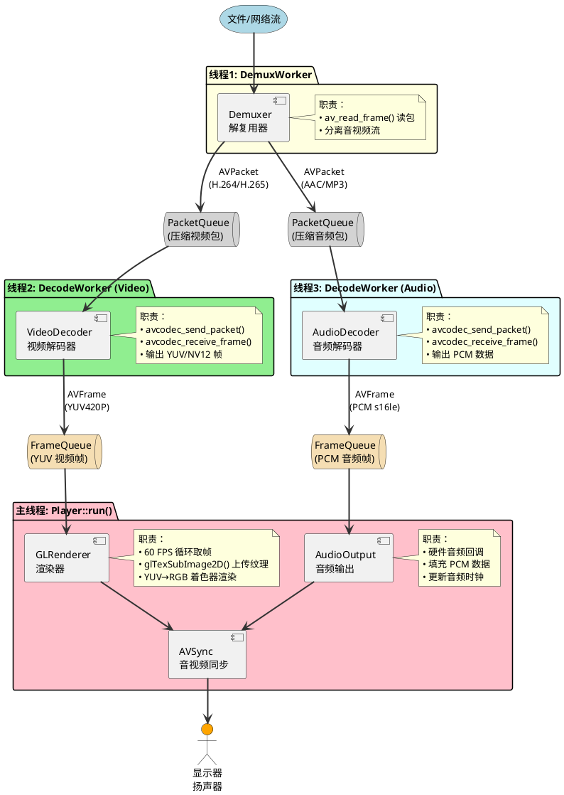
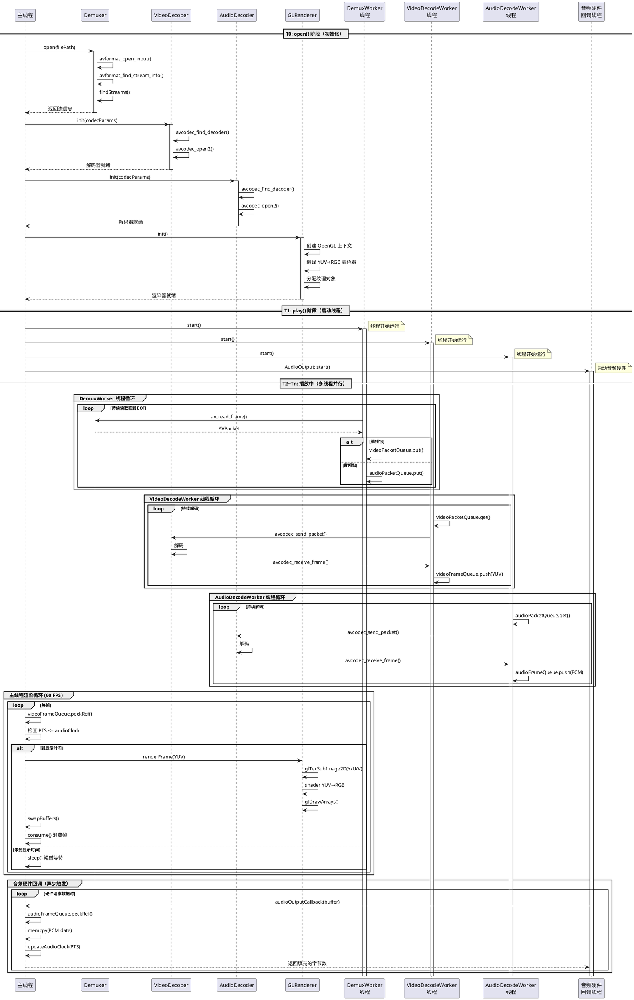

# FluxPlayer 播放器核心流程剖析

> 面向播放器入门者，聚焦从文件打开到播放渲染的核心数据流
> 不涉及 UI、录制等业务功能，只关注最基础的音视频播放原理

---

## 一、整体架构概览

FluxPlayer 采用经典的**生产者-消费者**模型，通过三个独立线程协同工作：



**核心思想**：解复用、解码在后台线程并行进行，渲染线程从队列取现成的帧直接显示，三者通过**线程安全队列**解耦。

---

## 二、数据流详解

### 2.1 启动流程：Player::open()

```cpp
// src/core/Player.cpp:201
bool Player::open(const std::string& filePath)
```

**步骤 1：创建解复用器（Demuxer）**

```cpp
// Player.cpp:345
demuxer_ = std::make_unique<Demuxer>();
bool opened = demuxer_->open(actualPath);
```

Demuxer 内部调用 FFmpeg 的 `avformat_open_input` 和 `avformat_find_stream_info`：

```cpp
// src/decoder/Demuxer.cpp:57
bool Demuxer::open(const std::string& filename) {
    // 步骤1：打开文件/流
    avformat_open_input(&m_formatCtx, filename.c_str(), nullptr, &options);
    
    // 步骤2：探测流信息（读取若干包，解析编解码器参数）
    avformat_find_stream_info(m_formatCtx, nullptr);
    
    // 步骤3：找到视频流和音频流
    findStreams();  // 遍历 nb_streams，记录 videoStreamIndex/audioStreamIndex
}
```

**关键数据结构**：
- `AVFormatContext`：文件容器上下文（存储所有流信息、时长、码率等）
- `AVStream`：单条流的信息（视频流、音频流各一条）
- `AVCodecParameters`：编解码器参数（分辨率、采样率、编码格式等）

---

**步骤 2：创建解码器（VideoDecoder / AudioDecoder）**

```cpp
// Player.cpp:413
initDecoders();
```

以视频解码器为例：

```cpp
// src/decoder/VideoDecoder.cpp:63
bool VideoDecoder::init(AVCodecParameters* codecParams, AVRational timeBase) {
    // 步骤1：根据 codec_id 查找解码器（如 H.264 → h264 解码器）
    const AVCodec* codec = avcodec_find_decoder(codecParams->codec_id);
    
    // 步骤2：分配解码器上下文
    m_codecCtx = avcodec_alloc_context3(codec);
    
    // 步骤3：复制编解码器参数到解码器上下文
    avcodec_parameters_to_context(m_codecCtx, codecParams);
    
    // 步骤4：打开解码器
    avcodec_open2(m_codecCtx, codec, nullptr);
}
```

**关键数据结构**：
- `AVCodec`：解码器实例（FFmpeg 内置的软件解码器或硬件加速解码器）
- `AVCodecContext`：解码器状态上下文

---

**步骤 3：创建队列**

```cpp
// Player.cpp:397-409
queueManager_->videoFrameQueue() = std::make_unique<FrameQueue>(videoQueueSize, /*keepLast=*/true);
queueManager_->audioFrameQueue() = std::make_unique<FrameQueue>(audioQueueSize, /*keepLast=*/false);
queueManager_->videoPacketQueue() = std::make_unique<PacketQueue>();
queueManager_->audioPacketQueue() = std::make_unique<PacketQueue>();
```

- **PacketQueue**：存储压缩数据包（`AVPacket`），demux 线程写入，decode 线程读取
- **FrameQueue**：存储解码后的帧（`Frame` 封装 `AVFrame`），decode 线程写入，主线程读取

---

**步骤 4：初始化渲染器（GLRenderer）**

```cpp
// Player.cpp:420
initWindowAndRenderer();
```

创建 OpenGL 上下文，编译 YUV → RGB 着色器，准备纹理对象。

---

### 2.2 播放流程：Player::play()

```cpp
// src/core/Player.cpp:527
bool Player::play() {
    // 启动三个工作线程
    startWorkerThreads();
    
    // 启动音频输出
    if (audioOutput_) {
        audioOutput_->start();
    }
    
    setState(PlayerState::PLAYING);
}
```

启动三个核心线程：

```cpp
// Player.cpp:1029
void Player::startWorkerThreads() {
    // 线程1：解复用线程
    demuxWorker_ = std::make_unique<DemuxWorker>(this);
    demuxWorker_->start();
    
    // 线程2：视频解码线程
    videoDecodeWorker_ = std::make_unique<DecodeWorker>(this, StreamKind::Video);
    videoDecodeWorker_->start();
    
    // 线程3：音频解码线程
    audioDecodeWorker_ = std::make_unique<DecodeWorker>(this, StreamKind::Audio);
    audioDecodeWorker_->start();
}
```

---

### 2.3 线程 1：DemuxWorker（解复用线程）

**职责**：从文件读取压缩数据包，分离音视频流，写入各自的 PacketQueue

```cpp
// src/core/DemuxWorker.cpp (简化后的伪代码)
void DemuxWorker::run() {
    AVPacket* packet = av_packet_alloc();
    
    while (!shouldQuit) {
        // 1. 背压控制：队列满时等待（避免内存爆炸）
        waitForPacketSpace();
        
        // 2. 读取一个压缩包（可能是视频或音频）
        if (!demuxer_->readPacket(packet)) {
            // EOF：发送空包通知 decode 线程
            sendNullPacket();
            break;
        }
        
        // 3. 根据 stream_index 分发到对应队列
        if (packet->stream_index == videoStreamIndex) {
            videoPacketQueue->put(packet);  // 写入视频 packet 队列
        } else if (packet->stream_index == audioStreamIndex) {
            audioPacketQueue->put(packet);  // 写入音频 packet 队列
        }
        
        av_packet_unref(packet);
    }
}
```

**关键 FFmpeg API**：
```cpp
// src/decoder/Demuxer.cpp:282
int av_read_frame(m_formatCtx, packet);  // 从文件读取下一个数据包
```

读取的 `AVPacket` 包含：
- `data`：压缩的视频/音频数据（如 H.264 NAL units）
- `size`：数据大小
- `pts`：显示时间戳（Presentation Time Stamp）
- `stream_index`：所属流索引（0=视频，1=音频）

---

### 2.4 线程 2：DecodeWorker（解码线程）

**职责**：从 PacketQueue 取压缩包，解码为原始帧，写入 FrameQueue

以视频解码为例：

```cpp
// src/core/DecodeWorker.cpp:52 (简化伪代码)
void DecodeWorker::runVideo() {
    AVPacket* packet = av_packet_alloc();
    Frame rawFrame;
    
    while (!shouldQuit) {
        // 1. 从 packet 队列取一个压缩包（阻塞等待）
        videoPacketQueue->get(packet, /*block=*/true);
        
        // 2. 送入解码器
        videoDecoder_->sendPacket(packet);
        av_packet_unref(packet);
        
        // 3. 从解码器取出解码后的帧（一个 packet 可能产生多帧或零帧）
        while (videoDecoder_->receiveFrame(rawFrame)) {
            // 4. 计算帧的 PTS（显示时间）
            normalizePTS(rawFrame);
            
            // 5. 写入帧队列（阻塞等待队列有空位）
            Frame* slot = videoFrameQueue->peekWritable();
            slot->reference(rawFrame.getAVFrame());
            slot->setPTS(pts);
            videoFrameQueue->push();
            
            rawFrame.unreference();
        }
    }
}
```

**关键 FFmpeg API**：
```cpp
// src/decoder/VideoDecoder.cpp:185
avcodec_send_packet(m_codecCtx, packet);   // 送入压缩包
avcodec_receive_frame(m_codecCtx, frame);  // 取出解码后的帧
```

**解码输出的 `AVFrame`**：
- 视频帧：YUV420P 或 NV12 像素数据（三个平面：Y, U, V 或 Y, UV）
  - `data[0]`：Y 平面指针（亮度）
  - `data[1]`：U/UV 平面指针（色度）
  - `data[2]`：V 平面指针（仅 YUV420P）
  - `linesize[0/1/2]`：每个平面的行字节数（stride）
- 音频帧：PCM 数据（`data[0]` 是交错的采样点，如 16-bit stereo）

---

### 2.5 主线程：渲染循环 Player::run()

```cpp
// src/core/Player.cpp:637
void Player::run() {
    while (!window_->shouldClose() && !shouldQuit_) {
        // 1. 渲染视频帧
        renderVideoFrame(lastFrameTime);
        
        // 2. 渲染 UI（如果有）
        if (renderCallback_) {
            renderCallback_();
        }
        
        // 3. 交换缓冲区显示
        window_->swapBuffers();
        window_->pollEvents();
    }
}
```

**核心：renderVideoFrame() 函数**

```cpp
// src/core/Player.cpp:727 (简化伪代码)
void Player::renderVideoFrame(double& lastFrameTime) {
    Frame leasedFrame;
    
    // 1. 从帧队列 peek 一帧（不消费，只看）
    if (!videoFrameQueue->peekRef(leasedFrame)) {
        return;  // 队列空，复用上一帧纹理
    }
    
    double nextPTS = leasedFrame.getPTS();
    double masterClock = avSync->getMasterClock();  // 主时钟（通常是音频时钟）
    
    // 2. 音视频同步判断：帧的 PTS <= 主时钟才显示
    if (nextPTS <= masterClock + 0.005) {
        // 3. 消费这一帧（从队列移除）
        videoFrameQueue->consume();
        
        AVFrame* avFrame = leasedFrame.getAVFrame();
        
        // 4. 上传到 GPU 并渲染
        renderer_->renderFrame(
            avFrame->data[0], avFrame->data[1], avFrame->data[2],  // YUV 三个平面
            avFrame->linesize[0], avFrame->linesize[1], avFrame->linesize[2],
            isNV12, colorSpace, fullRange
        );
        
        // 5. 更新视频时钟
        avSync->updateVideoClock(nextPTS);
        lastRenderedPTS_ = nextPTS;
    } else {
        // 还没到显示时间，短暂 sleep 避免空转
        sleep((nextPTS - masterClock) * 0.8);
    }
}
```

**渲染到屏幕的关键流程**：

```cpp
// src/renderer/GLRenderer.cpp (简化伪代码)
void GLRenderer::renderFrame(uint8_t* y, uint8_t* u, uint8_t* v, 
                              int strideY, int strideU, int strideV,
                              bool isNV12, int colorSpace, int fullRange) {
    // 1. 上传 YUV 数据到 GPU 纹理
    glBindTexture(GL_TEXTURE_2D, textureY_);
    glTexSubImage2D(GL_TEXTURE_2D, 0, 0, 0, width_, height_, 
                    GL_RED, GL_UNSIGNED_BYTE, y);
    
    glBindTexture(GL_TEXTURE_2D, textureU_);
    glTexSubImage2D(..., u);
    
    glBindTexture(GL_TEXTURE_2D, textureV_);
    glTexSubImage2D(..., v);
    
    // 2. 使用着色器将 YUV 转换为 RGB 并绘制到屏幕
    shader_->use();
    shader_->setInt("colorSpace", colorSpace);  // BT.601 / BT.709 / BT.2020
    shader_->setInt("fullRange", fullRange);
    glDrawArrays(GL_TRIANGLES, 0, 6);  // 绘制两个三角形（矩形）
}
```

**YUV → RGB 转换在 GPU 着色器中完成**（`resources/shaders/video.frag`）：
- 读取三个纹理采样 Y/U/V 值
- 根据 `colorSpace` 选择转换矩阵（BT.709 用于 HD，BT.601 用于 SD）
- 输出 RGB 像素到帧缓冲

---

### 2.6 音频播放：audioOutputCallback()

音频不像视频在主循环渲染，而是通过**硬件回调**驱动（系统音频线程请求数据时触发）：

```cpp
// src/core/Player.cpp:1385 (简化伪代码)
size_t Player::audioOutputCallback(uint8_t* buffer, size_t bufferSize) {
    Frame leasedAudio;
    size_t filled = 0;
    
    // 1. 循环填充回调缓冲区
    while (filled < bufferSize) {
        // 2. 从音频帧队列 peek 一帧
        if (!audioFrameQueue->peekRef(leasedAudio)) {
            break;  // 队列空，填充静音
        }
        
        AVFrame* avFrame = leasedAudio.getAVFrame();
        
        // 3. 拷贝 PCM 数据到回调缓冲区
        size_t bytesToCopy = min(avFrame->nb_samples * frameBytes, bufferSize - filled);
        memcpy(buffer + filled, avFrame->data[0], bytesToCopy);
        filled += bytesToCopy;
        
        // 4. 消费这一帧（或标记部分消费的偏移）
        if (bytesToCopy == frameDataSize) {
            audioFrameQueue->next();
        } else {
            pendingAudioOffset_ = bytesToCopy;  // 下次从中间续读
        }
    }
    
    // 5. 更新音频时钟（音视频同步的主时钟）
    double currentPTS = firstFramePTS + (filled / sampleRate / channels);
    avSync->updateAudioClock(currentPTS);
    
    return filled;
}
```

**音频时钟驱动同步**：
- 音频回调以**硬件采样率**精确推进（如 48000 Hz），比视频帧率稳定
- 视频渲染时对比 `videoPTS` 和 `audioClock`，PTS 落后则等待，超前则丢帧

---

## 三、关键数据结构

### 3.1 PacketQueue（压缩包队列）

```cpp
// src/core/PacketQueue.h
class PacketQueue {
    std::queue<AVPacket*> queue_;       // 存储压缩包的队列
    std::mutex mutex_;                  // 保护队列的互斥锁
    std::condition_variable cond_;      // 阻塞等待的条件变量
    int serial_;                        // 序列号（seek 时递增，标记队列版本）
    
public:
    void put(AVPacket* pkt);            // 生产者写入（DemuxWorker 调用）
    int get(AVPacket* pkt, bool block); // 消费者读取（DecodeWorker 调用）
    void flush();                       // 清空队列（seek 时调用）
};
```

**为什么需要 serial？**
- Seek 时主线程调用 `flush()` 清空队列并递增 `serial_`
- DecodeWorker 收到新包时检测到 `serial` 变化，立即 flush 解码器和帧队列
- 避免 seek 后残留旧帧闪烁

---

### 3.2 FrameQueue（解码帧队列）

```cpp
// src/core/FrameQueue.h
class FrameQueue {
    std::vector<Frame> frames_;         // 预分配的帧槽数组
    int rindex_;                        // 读索引（主线程消费）
    int windex_;                        // 写索引（DecodeWorker 生产）
    int size_;                          // 当前队列中的帧数
    bool keep_last_;                    // 暂停时保留最后一帧
    
public:
    Frame* peekWritable();              // 取可写槽位（阻塞等待队列有空位）
    void push();                        // 提交写入（windex++）
    bool peekRef(Frame& out);           // 取独立引用用于读取（不消费）
    void consume();                     // 消费当前帧（rindex++）
};
```

**独立引用机制**（`peekRef`）：
- 主线程调用 `peekRef` 时，`av_frame_ref` 复制一份引用（引用计数+1）
- 即使 DecodeWorker 随后 flush 队列，主线程持有的引用仍然有效
- 渲染完成后自动释放引用（`Frame` 析构时调用 `av_frame_unref`）

---

### 3.3 AVSync（音视频同步）

```cpp
// src/core/AVSync.h
class AVSync {
    double videoClock_;      // 当前视频时钟（最后渲染帧的 PTS）
    double audioClock_;      // 当前音频时钟（音频回调更新）
    double externalClock_;   // 外部时钟（系统墙钟，音频失败时降级）
    ClockType masterClock_;  // 主时钟类型（AUDIO_CLOCK 或 EXTERNAL_CLOCK）
    
public:
    double getMasterClock();         // 获取主时钟（同步基准）
    void updateVideoClock(double pts);
    void updateAudioClock(double pts);
};
```

**同步策略**：
- **有音频**：主时钟 = 音频时钟，视频追随音频
- **无音频**：主时钟 = 外部时钟（系统时间），视频按帧率自由播放

---

## 四、完整数据流时序图



---

## 五、关键 FFmpeg API 速查

| API | 作用 | 调用位置 |
|-----|------|---------|
| `avformat_open_input` | 打开文件/流 | Demuxer::open |
| `avformat_find_stream_info` | 探测流信息 | Demuxer::open |
| `av_read_frame` | 读取压缩包 | DemuxWorker::run |
| `avcodec_find_decoder` | 查找解码器 | VideoDecoder::init |
| `avcodec_open2` | 打开解码器 | VideoDecoder::init |
| `avcodec_send_packet` | 送入压缩包 | DecodeWorker::run |
| `avcodec_receive_frame` | 取出解码帧 | DecodeWorker::run |
| `av_frame_ref` | 增加帧引用 | FrameQueue::peekRef |
| `av_frame_unref` | 释放帧引用 | Frame 析构 |

---

## 六、学习建议

1. **先看单线程简化版本**  
   建议先理解 Demuxer → Decoder → Renderer 的单线程顺序流程，再学习多线程版本

2. **调试关键路径**  
   在以下位置打断点观察数据流：
   - `Demuxer::readPacket` 返回后查看 `packet->data`
   - `VideoDecoder::receiveFrame` 返回后查看 `AVFrame->data[0]`
   - `GLRenderer::renderFrame` 查看纹理上传

3. **阅读顺序推荐**
   ```
   Demuxer.cpp (理解容器解析)
       ↓
   VideoDecoder.cpp (理解解码流程)
       ↓
   PacketQueue.cpp + FrameQueue.cpp (理解队列同步)
       ↓
   DemuxWorker.cpp + DecodeWorker.cpp (理解线程协作)
       ↓
   Player::renderVideoFrame (理解渲染与同步)
   ```

4. **FFmpeg 官方文档**  
   - [FFmpeg Decoding Tutorial](https://ffmpeg.org/doxygen/trunk/group__lavc__decoding.html)
   - [AVFrame 结构体](https://ffmpeg.org/doxygen/trunk/structAVFrame.html)

---

## 七、常见问题

**Q: 为什么要用三个独立线程？**  
A: 解复用、解码、渲染的耗时差异大。单线程会导致：
- 网络读取慢时，解码器空转
- 解码慢时（4K 视频），渲染卡顿
- 渲染慢时（复杂 UI），解码器缓冲溢出

三线程通过队列解耦，各自按最优速度工作。

**Q: PacketQueue 和 FrameQueue 有什么区别？**  
A: 
- PacketQueue 存储**压缩数据**（如 H.264 NAL units），占用小但不能直接使用
- FrameQueue 存储**解码后的原始像素/音频**，占用大但可直接渲染

**Q: 为什么视频要用 YUV 格式而不是 RGB？**  
A: 
- 视频编码器（H.264/H.265）输出的就是 YUV
- YUV 色度子采样（4:2:0）比 RGB 节省 50% 内存
- GPU 纹理直接用 YUV，着色器转换为 RGB 更高效

**Q: Seek 时如何保证音视频同步？**  
A: 
1. 主线程调用 `demuxer->seek(target)`，跳转到最近的关键帧
2. 清空所有队列（PacketQueue + FrameQueue）并递增 `serial`
3. DecodeWorker 检测到 `serial` 变化，flush 解码器
4. 进入"精确跳转模式"：丢弃 PTS < target 的帧，直到第一个 >= target 的帧
5. 更新 AVSync 时钟到 target，音视频重新对齐

---

**总结**：FluxPlayer 的核心是**生产者-消费者**模型 + **音视频同步**。掌握 FFmpeg 解复用/解码 API、线程安全队列、OpenGL 纹理上传这三块，就理解了播放器的本质。
