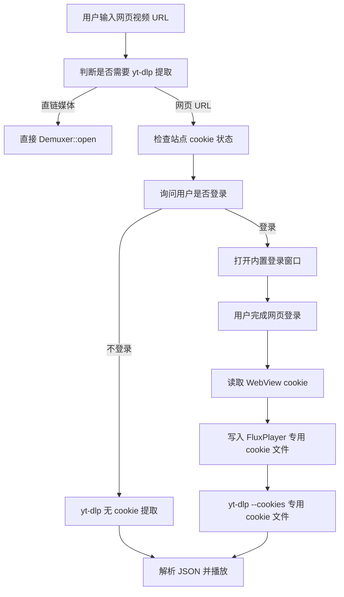

# FluxPlayer 内置登录 Cookie 技术方案

## 目标

取消配置文件中由用户手动指定 cookie 文件的配置项，改为由 FluxPlayer 自己维护一个专用 cookie 文件。

播放网页视频时，流程改为：

1. 用户输入网页视频 URL。
2. FluxPlayer 询问是否登录该站点。
3. 用户选择登录时，打开内置登录窗口。
4. 登录完成后，程序从内置浏览器读取 cookie，写入 FluxPlayer 专用 cookie 文件。
5. yt-dlp 使用该专用 cookie 文件提取视频流。
6. 用户选择不登录时，yt-dlp 不携带 cookie，直接按公开网页视频方式提取。

这个方案不再读取用户本机 Edge / Chrome 的 cookie 数据库，因此避开 Windows 上浏览器后台进程锁定 cookie 数据库的问题。

---

## 背景问题

当前方案依赖：

```ini
[Stream]
cookiesBrowser=auto
cookiesFile=
```

实际问题：

- `--cookies-from-browser edge/chrome` 在 Windows 上容易失败，原因是 Chromium 系浏览器会锁住 cookie SQLite 数据库。
- `cookiesFile` 需要用户手动导出 Netscape 格式 cookie，体验差。
- 每次尝试读取本机浏览器 cookie 都可能带来额外耗时。
- cookie 文件路径暴露在配置中，用户容易配置错，也不利于统一维护。

新方案改为：

- 不再读默认浏览器 cookie。
- 不再让用户在配置文件里填 cookie 文件路径。
- 使用内置登录窗口获取 cookie。
- FluxPlayer 自己维护 cookie store。
- yt-dlp 只读取 FluxPlayer 维护的 cookie 文件。

---

## 总体方案



yt-dlp 调用方式：

```powershell
yt-dlp -j --no-playlist --no-warnings ^
  --impersonate edge-101:windows-10 ^
  --cookies "<fluxplayer.ini 所在目录>\cookies\web_cookies.txt" ^
  "https://example.com/video"
```

不登录时：

```powershell
yt-dlp -j --no-playlist --no-warnings ^
  --impersonate edge-101:windows-10 ^
  "https://example.com/video"
```

---

## 配置文件调整

从 `fluxplayer.ini` 中移除以下配置项：

```ini
cookiesBrowser=auto
cookiesFile=
```

不再暴露 cookie 文件路径给用户。

`[Stream]` 可保留其他网络流相关配置，例如代理：

```ini
[Stream]
# 不再包含 cookiesBrowser / cookiesFile

[Proxy]
proxyEnabled=true
httpProxy=http://127.0.0.1:7890
socksProxy=socks5://127.0.0.1:7890
```

兼容策略：

- 读取旧配置时忽略 `cookiesBrowser` 和 `cookiesFile`。
- 保存配置时不再写出这两个字段。
- README 和 `fluxplayer.ini.sample` 同步删除 cookie 文件配置说明。

---

## Cookie 文件设计

### 存储路径

cookie 文件固定存放在 `fluxplayer.ini` 所在目录下，由 FluxPlayer 统一维护：

```text
<fluxplayer.ini 所在目录>/cookies/web_cookies.txt
```

默认配置目录示例：

```text
Windows: %LOCALAPPDATA%\FluxPlayer\cookies\web_cookies.txt
macOS:   ~/Library/Caches/FluxPlayer/cookies/web_cookies.txt
Linux:   ~/.cache/FluxPlayer/cookies/web_cookies.txt
```

说明：

- `Config` 当前已经负责定位 `fluxplayer.ini`，CookieStore 应复用该配置目录，而不是重新推导 AppData / Cache 路径。
- cookie 文件由程序维护，不进入项目仓库。
- cookie 文件路径不写入 `fluxplayer.ini`，避免用户手动配置或误改。
- 如果未来允许用户修改配置文件位置，cookie 文件会自动跟随新的 `fluxplayer.ini` 目录。

### 文件格式

使用 yt-dlp 可直接读取的 Netscape cookie 格式：

```text
# Netscape HTTP Cookie File
# This file is generated by FluxPlayer. Do not edit manually.
.bilibili.com	TRUE	/	TRUE	1767225600	SESSDATA	xxxx
.bilibili.com	TRUE	/	FALSE	1767225600	DedeUserID	123456
```

字段顺序：

```text
domain	include_subdomains	path	secure	expires	name	value
```

HttpOnly cookie 使用 Netscape 兼容写法：

```text
#HttpOnly_.bilibili.com	TRUE	/	TRUE	1767225600	SESSDATA	xxxx
```

### 维护规则

以 `(domain, path, name)` 作为唯一键。

写入时：

- 新 cookie 追加。
- 已存在 cookie 覆盖。
- 过期 cookie 删除。
- session cookie 的 expires 写 `0`。
- 每次保存前清理空值、过期项和重复项。

读取时：

- 根据输入 URL 的 eTLD+1 或 host 判断是否已有可用 cookie。
- 如果 cookie 文件不存在，视为未登录。
- 如果目标站点相关 cookie 全部过期，视为未登录。

安全策略：

- cookie 文件放在 `fluxplayer.ini` 所在目录下的 `cookies/` 子目录。
- Windows 上创建目录后设置当前用户可读写即可。
- 不打印 cookie 内容到日志。
- 日志只记录 cookie 文件是否存在、站点是否命中、cookie 数量，不记录 name/value。
- 后续可升级为平台加密存储，并在调用 yt-dlp 前临时导出 Netscape 文件：
  - Windows：DPAPI
  - macOS：Keychain

---

## 内置登录窗口设计

### 跨平台实现

第一版同时支持 Windows 和 macOS：

| 平台 | 内置浏览器实现 | Cookie 读取 API |
|------|----------------|-----------------|
| Windows | Microsoft WebView2 | WebView2 CookieManager |
| macOS | WKWebView | WKHTTPCookieStore / NSHTTPCookie |

公共层提供统一的 `WebLogin` 接口，平台相关实现放在独立源文件中。业务层只关心“打开登录窗口并返回 cookies”，不关心底层浏览器控件。

新增模块建议：

```text
include/FluxPlayer/utils/WebLogin.h
src/utils/WebLogin.cpp
src/utils/WebLogin_win.cpp
src/utils/WebLogin_mac.mm
include/FluxPlayer/utils/CookieStore.h
src/utils/CookieStore.cpp
```

职责划分：

| 模块 | 职责 |
|------|------|
| `WebLogin` | 创建内置登录窗口，加载站点登录页，等待用户完成登录 |
| `CookieStore` | 管理 `web_cookies.txt` 的读取、合并、清理、保存 |
| `StreamExtractor` | 根据用户选择决定是否给 yt-dlp 添加 `--cookies` |
| `Controller/HomeScreen` | 在打开网页 URL 时询问是否登录 |

### 平台实现细节

Windows：

- 使用 WebView2 Runtime。
- `WebLogin_win.cpp` 创建原生窗口并嵌入 WebView2。
- 用户点击 `完成登录` 后，通过 WebView2 CookieManager 读取目标 URL 相关 cookies。
- CMake / xmake 需要链接 WebView2 SDK，并在打包时处理 WebView2 Runtime 依赖。

macOS：

- 使用系统 WebKit.framework 中的 `WKWebView`。
- `WebLogin_mac.mm` 使用 Objective-C++ 实现 Cocoa 窗口和 WKWebView。
- 用户点击 `完成登录` 后，通过 `WKWebsiteDataStore.defaultDataStore.httpCookieStore` 读取 cookies。
- CMake / xmake 需要在 macOS 下链接 `Cocoa.framework` 和 `WebKit.framework`。
- 如果未来使用 App Sandbox，需要确认网络访问、WebKit 数据存储和 Keychain 权限；当前非沙盒包可先按普通桌面应用实现。

### 登录窗口行为

打开网页视频时弹出选择：

```text
该网页可能需要登录后播放，是否登录？

[登录并继续] [不登录打开]
```

如果本地已有该站点 cookie，可以改为：

```text
检测到已保存该站点登录信息，是否使用？

[使用已保存登录] [重新登录] [不登录打开]
```

用户选择登录：

1. 创建当前平台的原生登录窗口：
   - Windows：WebView2
   - macOS：WKWebView
2. 导航到输入 URL 对应站点。
3. 用户在网页里完成登录。
4. 窗口底部提供按钮：
   - `完成登录`
   - `取消`
5. 用户点击 `完成登录` 后，程序读取当前 URL 所属域名的 cookies。
6. 合并写入 `web_cookies.txt`。
7. 关闭登录窗口。
8. 使用 `--cookies web_cookies.txt` 重新调用 yt-dlp。

不建议自动判断登录完成，因为不同平台登录流程差异很大。MVP 采用用户点击 `完成登录` 的方式更稳定。

### Cookie 获取范围

从平台内置浏览器的 cookie API 获取 cookies：

- 当前页面 URL。
- 当前页面 eTLD+1 对应域名。
- 可选：平台适配时额外读取相关 API 域名。

例如 B 站：

```text
https://www.bilibili.com
https://api.bilibili.com
https://passport.bilibili.com
```

MVP 可先读取当前页面 URL 的 cookies；后续做平台适配表。

---

## 播放流程改造

### 1. 用户输入 URL

`Player::open(filePath)` 中，如果 `StreamExtractor::needsExtraction(filePath)` 为 true，进入网页登录策略。

### 2. 询问登录

新增一个登录策略结果：

```cpp
enum class WebCookieMode {
    NoCookie,
    UseStoredCookie,
    LoginAndUseCookie,
    Cancel
};
```

推荐逻辑：

```text
如果 cookie store 中有目标站点 cookie：
    询问：使用已保存登录 / 重新登录 / 不登录
否则：
    询问：登录并继续 / 不登录打开
```

### 3. yt-dlp 参数构造

取消 `prepareCookieArg()` 对 `cookiesBrowser/cookiesFile` 的依赖。

改为：

```cpp
std::string prepareCookieArgForUrl(const std::string& pageUrl, WebCookieMode mode) {
    if (mode == WebCookieMode::NoCookie) return "";
    if (!CookieStore::hasCookiesForUrl(pageUrl)) return "";
    return " --cookies \"" + CookieStore::cookieFilePath() + "\"";
}
```

继续保留浏览器请求伪装：

```cpp
--impersonate edge-101:windows-10
```

注意不要再调用：

```text
--cookies-from-browser edge
--cookies-from-browser chrome
```

---

## CookieStore 设计

### 接口草案

```cpp
class CookieStore {
public:
    static std::string getCookieFilePath();
    static std::string getCookieDir();

    static bool exists();
    static bool hasCookiesForUrl(const std::string& url);

    static bool mergeNetscapeCookies(const std::vector<NetscapeCookie>& cookies,
                                     std::string* error);

    static bool pruneExpired(std::string* error);
    static bool save(std::string* error);
};
```

### Cookie 结构

```cpp
struct NetscapeCookie {
    std::string domain;
    bool includeSubdomains = false;
    std::string path = "/";
    bool secure = false;
    int64_t expires = 0;
    std::string name;
    std::string value;
    bool httpOnly = false;
};
```

### 浏览器 Cookie 转换

WebView2 / WKWebView 获取到的 cookie 最终都转换为统一的 `NetscapeCookie`：

| Netscape 字段 | Windows WebView2 | macOS WKWebView / NSHTTPCookie |
|---------------|------------------|--------------------------------|
| `domain` | `Domain` | `domain` |
| `path` | `Path` | `path` |
| `secure` | `IsSecure` | `isSecure` |
| `expires` | `Expires` | `expiresDate` |
| `name` | `Name` | `name` |
| `value` | `Value` | `value` |
| `httpOnly` | `IsHttpOnly` | `isHTTPOnly` |

`includeSubdomains` 判断：

- domain 以 `.` 开头：`TRUE`
- domain 不以 `.` 开头：`FALSE`

---

## 失败处理

### 用户取消登录

行为：

- 不写 cookie。
- 按无 cookie 方式继续提取。

### 登录后没有拿到 cookie

提示：

```text
未检测到该站点登录 cookie，将使用未登录方式打开。
```

然后无 cookie 提取。

### cookie 过期

如果 yt-dlp 返回登录相关错误：

- 提示用户重新登录。
- 提供 `重新登录` 和 `不登录重试` 两个选项。

### DRM 内容

需要明确限制：

- cookie 只能提供登录态。
- 如果平台使用 DRM，yt-dlp 仍可能无法提取可播放明文流。
- DRM 内容需要浏览器内核播放，不属于本方案解决范围。

---

## 迁移步骤

### 阶段 1：移除配置项

- 从 `Config::Settings` 删除 `cookiesBrowser`。
- 从 `Config::Settings` 删除 `cookiesFile`。
- `Config::load()` 忽略旧配置中的这两个 key。
- `Config::save()` 不再写出这两个 key。
- 更新 `fluxplayer.ini.sample`。
- 更新 README 中 cookie 配置说明。

### 阶段 2：CookieStore

- 新增 `CookieStore`。
- 通过 `fluxplayer.ini` 所在目录确定 cookie 存储目录。
- 实现 Netscape cookie 文件读写。
- 实现合并、去重、过期清理。
- 实现 `hasCookiesForUrl()`。

### 阶段 3：跨平台登录窗口

- 新增公共 `WebLogin` 接口。
- Windows 引入 WebView2 SDK，实现 `WebLogin_win.cpp`。
- macOS 引入 Cocoa / WebKit，实现 `WebLogin_mac.mm`。
- 实现登录窗口。
- 实现 `完成登录` 后读取 cookies。
- 将平台 cookies 转换为 `NetscapeCookie` 并写入 CookieStore。

### 阶段 4：StreamExtractor 接入

- 移除 `--cookies-from-browser` 逻辑。
- 移除复制浏览器 cookie 数据库逻辑。
- 新增 `--cookies web_cookies.txt` 逻辑。
- 保留 `--impersonate`。
- 用户选择不登录时不传 `--cookies`。

### 阶段 5：UI 接入

- 在打开网页 URL 前弹出登录询问。
- 已有 cookie 时提供使用、重新登录、不登录三选项。
- 登录失败或 cookie 过期时引导重新登录。

---

## 验证计划

### 功能验证

1. 未登录打开公开视频：
   - 不生成 cookie。
   - yt-dlp 不带 `--cookies`。
   - 能正常播放公开内容。

2. 首次登录打开需要登录的视频：
   - 弹出登录询问。
   - 打开内置登录窗口。
   - 点击完成登录后生成 `web_cookies.txt`。
   - yt-dlp 带 `--cookies web_cookies.txt`。
   - 能提取登录内容。

3. 再次打开同站点视频：
   - 检测到已有 cookie。
   - 可选择使用已保存登录。
   - 不需要再次登录。

4. cookie 过期：
   - yt-dlp 返回登录失败。
   - UI 提示重新登录。
   - 重新登录后覆盖旧 cookie。

### 安全验证

- 日志中不出现 cookie value。
- cookie 文件不写入项目仓库。
- cookie 文件不会被打包进发布包。
- 清理 cookie 后无法继续提取登录内容。

### 回归验证

- 本地视频播放不受影响。
- 直链 HTTP / HLS / RTSP / RTMP 不受影响。
- 公开视频的无 cookie 提取速度不变或更快。
- 画质切换时沿用本次打开选择的 cookie 策略。

---

## 推荐 MVP 范围

第一版同时支持 Windows 和 macOS：

- Windows：WebView2 登录窗口。
- macOS：WKWebView 登录窗口。
- 单一 `web_cookies.txt` cookie store。
- B 站 / YouTube 等通用站点先按当前页面域名读取 cookie。
- 不做浏览器数据库读取。
- 不做 DPAPI / Keychain 加密。
- 不做浏览器扩展。

后续增强：

- 平台适配表：为 B 站、YouTube、抖音等读取关联域名 cookie。
- cookie 管理 UI：查看站点、删除站点登录、清空全部 cookie。
- Windows DPAPI / macOS Keychain 加密存储，调用 yt-dlp 前导出临时文件。
