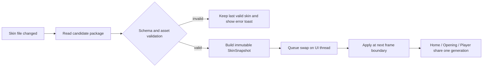

# FluxPlayer 皮肤系统设计

## 1. 目标

FluxPlayer 的皮肤系统用于替换 UI 的视觉表达，而不改变播放器能力与交互语义。

- 默认启用当前蓝紫赛博朋克皮肤 `cyberpunk-neon`。
- 用户可安装其他皮肤包，并在 `SETTINGS > APPEARANCE` 中切换。
- 开发或创作皮肤时，可在运行中修改文件并自动刷新，无需重启播放器或中断媒体播放。
- 任意皮肤加载失败时，保持上一次有效皮肤；首次启动即失败时，回退到内置 `cyberpunk-neon`。

## 2. 不可换肤的功能契约

皮肤只决定“如何画”，不决定“画不画”。渲染代码负责下列固定槽位，任何皮肤都不得隐藏、合并或重命名其核心动作：

| Surface | 必须保留的功能槽位 |
| --- | --- |
| Home | `OPEN LOCAL FILE`、`OPEN URL` 两个入口 |
| Opening | `RESOLVING SOURCE...`、`OPENING MEDIA STREAM...`、`READY`、打开失败后回到 Home |
| Player Dock | 播放/暂停、停止、Seek、音量/静音、速度、网页画质、`Download` |
| Player Dock | 下载百分比、暂停/继续、取消、速度、文件大小、`ETA` |
| Player Dock | 独立 `REC V` 与 `REC A`、`SET` |
| HUD / Settings | 循环、字幕、媒体信息、统计、录制质量、皮肤选择、快捷键提示 |

字幕内容的高对比度与视频画面优先级也属于产品约束：皮肤可提供字幕色建议，但不得令字幕不可读或用装饰遮挡视频主体。

## 3. 包结构

一个皮肤是一个独立目录，以 `skin.json` 作为唯一运行时入口：

```text
source/UI/
  skin.schema.json
  skins/
    cyberpunk-neon/
      skin.json
      preview.svg                 # 设置面板中的预览
      mockup_home.svg             # 官方皮肤验收用状态稿
      mockup_opening.svg
      mockup_player.svg
      mockup_components.svg
      mockup_skin_settings.svg
      fonts/                      # 可选，只从当前包内加载
      textures/                   # 可选，不可替代功能控件
  concepts/
    future-neon-console/          # 未来视觉概念稿，不属于任何已加载皮肤
```

运行时只依赖清单声明的资源；`mockup_*.svg` 属于设计和验收资产，可随官方皮肤发布，也可从第三方精简发行包中省略。
`source/UI/concepts/` 不在 `resources/skins` 的复制路径内，不参与运行时选择；其中归档的未来稿只有在另建皮肤包并完成实现后才能成为验收基准。

位置优先级：

| 来源 | 用途 | 优先级 |
| --- | --- | --- |
| 应用内置 `resources/skins/<id>` | 发布时随应用提供的可靠回退 | 最低且始终可用 |
| 开发目录 `source/UI/skins/<id>` | 本仓库设计与开发调试 | 开发构建覆盖内置 |
| 用户目录 `<AppData>/skins/<id>` | 用户安装或正在编辑的皮肤 | 最高 |

同一个 `id` 存在多个来源时选择优先级最高且校验成功的一份。用户包损坏不应阻止回退到同 id 的内置包。

## 4. `skin.json` 数据边界

配置协议见 `../source/UI/skin.schema.json`，默认实例见 `../source/UI/skins/cyberpunk-neon/skin.json`。

### 4.1 可配置内容

| 区域 | 内容 |
| --- | --- |
| `roles` | 背景、强调色、文本、状态色、结构线等语义颜色 |
| `gradients` | 主轨道、Dock 顶边、面板标题等颜色序列 |
| `metrics` | 圆角、间距、Dock/HUD/Opening/Home 等尺寸 |
| `surfaces` | Home、Opening、Player、HUD、Settings、Popup、Subtitle 的局部布局与对齐参数 |
| `motion` | 扫描线、脉冲、hover、自动隐藏等时序 |
| `typography` | 标题、正文、时间码字号及可选字体资源 |
| `decoration` | 切角、辉光、扫描纹理、网格/粒子等装饰开关 |
| `assets` | 限定在包目录内的预览、字体、纹理相对路径 |

### 4.2 不可配置内容

- 功能按钮的存在性、动作 id、快捷键和文案含义。
- 播放、下载、录制状态机与网络加载阶段。
- 文件路径、网络 URL、登录信息、播放器设置值。
- 可执行代码、着色器代码、外部 URL 或包目录外的资源路径。

## 5. 默认皮肤 `cyberpunk-neon`

默认皮肤的完整资产位于 `../source/UI/skins/cyberpunk-neon/`：

| 文件 | 用途 |
| --- | --- |
| `skin.json` | 默认皮肤清单与唯一 token 来源 |
| `preview.svg` | Appearance 列表预览 |
| `mockup_home.svg` | 启动控制台 |
| `mockup_opening.svg` | URL 打开和首帧等待态 |
| `mockup_player.svg` | 播放 Dock、HUD、下载活动态与独立录制动作 |
| `mockup_components.svg` | 按钮、进度、下载等状态组件 |
| `mockup_skin_settings.svg` | 完整设置模态与外观/热加载状态 |

后续新增皮肤不应改写默认皮肤，而应添加新的 `<id>/skin.json` 与其自有资源目录。

### 5.1 默认视觉规则

`cyberpunk-neon` 的主题名称为 **Neon Drive Console**：深黑蓝金属底、cyan 主操作光、violet/magenta 次级能量、低圆角切角框与克制的 HUD 光带。

| 角色 | 默认表现 |
| --- | --- |
| 背景 | 近黑蓝画布与半透明蓝黑面板 |
| 主操作 | cyan，用于打开本地文件、播放、进度头与主要聚焦 |
| 次级模式 | violet/magenta，用于 URL、画质、设置与轨道尾光 |
| 录制/错误 | rose，仅用于录制、失败及危险操作 |
| 文本 | ice white 主字与 steel blue 弱字 |
| 装饰 | 切角框、短刻线、扫描纹理和有限的边缘辉光 |

发光用于交互反馈和关键状态，不能铺满视频区域；字幕保持高对比白字加深色描边，不随强调色改变可读性。

### 5.2 默认 Surface 规格

尺寸与精确颜色以 `skin.json` 为准，以下为视觉验收基线：

| Surface | 默认结构 | 关键要求 |
| --- | --- | --- |
| Home | 居中来源面板、标题、本地文件按钮和 URL 行 | 保留本地文件、URL 和已有拖放能力 |
| Opening | 遮罩与中央进度面板 | URL 解析期间同一播放器窗口持续可见 |
| Player | 底部两行 Dock 与可选 HUD | 视频优先，控件自动隐藏后可恢复 |
| Components | 按钮、进度轨、Popup、下载模块 | 所有状态由语义 token 表达 |
| Appearance | 设置导航、皮肤卡片、热加载控件 | 换肤期间播放保持继续 |

默认尺寸：

| 项 | 值 |
| --- | --- |
| Bottom Dock | `64px` |
| Dock Edge Rail | `2px` |
| Media Info HUD | `450 x 250px`，含网页信息时高 `320px` |
| Statistics HUD | `240 x 180px` |
| Progress interactive / visible | `16px` / `16px` |
| Play Button | `80 x 22px` |
| Home Main Card | `520 x 400px`，内边距 `32 x 28px` |
| Home Local Button | `320 x 48px` |
| Home URL Row | `OPEN URL` 宽 `90px`，控件间距 `8px` |
| Opening Panel | `560 x 200px` |
| Settings Modal | 最大 `920 x 640px`，屏幕占比不超过 `92% x 88%`；左侧四页导航 |

### 5.3 组件与状态约束

- Home 居中卡片保留 `OPEN LOCAL FILE`、URL 输入与 `OPEN URL`；皮肤不得删去或合并这些入口。
- Opening 在 URL 提取与媒体打开期间展示真实阶段文案与循环点阵；没有真实缓冲数据时不显示伪造百分比。
- Player Dock 第一行展示 seek 轨与时间码；第二行容纳网页画质/下载、播放/停止/独立录制及设置/音量。
- 下载 active module 同时显示百分比、暂停/继续、取消、下载速度、文件大小及 `ETA`；动作名使用 `Download`，不使用 `DL`。
- 录像和录音保持两个独立动作 `REC V`、`REC A`；窄屏可简化标签，但不可合并操作。
- `SET` 中按 `GENERAL`、`CAPTURE`、`LOGGING`、`APPEARANCE` 分页；保留循环、字幕、代理、媒体信息、统计、录制/截图、日志等级/文件/TCP 端口与换肤控制。

## 6. Appearance 设置界面

皮肤选择位于已有 `SET` 入口下的 `APPEARANCE` 分区，默认稿参见 `../source/UI/skins/cyberpunk-neon/mockup_skin_settings.svg`。

| 控件 | 作用 |
| --- | --- |
| `ACTIVE SKIN` | 展示当前皮肤名及来源，例如 `CYBERPUNK NEON / BUILT-IN` |
| Skin 列表 | 选择并即时试用已通过校验的包 |
| `HOT RELOAD` toggle | 监听当前激活的用户或开发皮肤修改 |
| `RELOAD NOW` | 手动重新解析当前皮肤 |
| `RESTORE DEFAULT` | 切回内置 `cyberpunk-neon` |
| 状态行 | `WATCHING`、`APPLIED`、`INVALID - USING PREVIOUS SKIN` 等反馈 |

选择皮肤不应终止当前播放。Dock、HUD 和 Opening overlay 在下一帧整体更新，避免同时展示新旧两套主题。

开发构建中的 `source/UI/skins/cyberpunk-neon` 是可编辑来源，可以显示 `WATCHING`；发布包内的内置副本只承担只读回退。

## 7. 热加载生命周期



### 7.1 监听范围

- 监听激活包的 `skin.json` 及清单引用到的 font、texture、preview 文件。
- 未激活皮肤不持续监听；列表刷新可在打开 Appearance 或点击刷新时执行。
- 文件可能在写入中短暂不完整，检测变更后 debounce `100-200ms` 再读取。

### 7.2 事务规则

1. 后台线程只负责检测修改、读取文件和校验，不直接调用 ImGui/OpenGL。
2. 候选包完整通过校验后生成不可变 `SkinSnapshot`。
3. UI 主线程在新一帧开始前一次性替换当前快照。
4. 字体 atlas 或纹理涉及 GPU 资源时，在持有正确 OpenGL context 的 UI 线程重建。
5. 重建失败则整个候选应用失败，继续使用旧皮肤。

### 7.3 共享窗口与 ImGui 上下文

GUI 模式下 `UiContext` 在应用生命周期内持有同一个窗口与 ImGui context；`HomeScreen`、`OpeningScreen` 和 `Controller` 轮流使用它。因此慢 URL 打开不会先关闭首页窗口再创建播放器窗口。`SkinManager` 是进程级数据源，每个可见渲染阶段按 `generation` 应用更新：

```text
SkinManager: currentSnapshot + generation
HomeScreen:  appliedGeneration -> applyStyle()/refreshFonts()
OpeningUI:   appliedGeneration -> applyStyle()/refreshFonts()
Controller:  appliedGeneration -> applyStyle()/refreshFonts()
```

各界面在自己的 frame begin 阶段应用更新，文件监听线程不得触碰 DrawList。

## 8. 校验与安全

加载前必须验证：

- `schemaVersion` 与 `compatibility.skinApi` 受支持。
- 必需语义颜色、尺寸与状态槽完整，数值处于安全范围。
- alpha、尺寸、时序均为有限值；Dock 不得遮挡过多画面。
- `assets` 只允许相对路径，规范化后仍处于皮肤目录内。
- 资源类型限制为支持的字体或图片格式，并限制单文件与整包大小。
- 未知字段默认拒绝，以及时暴露皮肤作者的配置拼写错误。

错误反馈示例：

```text
SKIN RELOAD FAILED: roles.accent.primary is missing
USING PREVIOUS SKIN: Cyberpunk Neon v1.0.0
```

## 9. 实现接口建议

```cpp
struct SkinSnapshot {
    std::string id;
    std::string displayName;
    uint64_t generation;
    SkinColors colors;
    SkinGradients gradients;
    SkinMetrics metrics;
    SkinSurfaces surfaces;
    SkinMotion motion;
    SkinTypography typography;
    SkinDecoration decoration;
};

class SkinManager {
public:
    bool initialize(const std::string& selectedId, bool hotReload);
    std::shared_ptr<const SkinSnapshot> current() const;
    void pollChanges();
    bool selectSkin(const std::string& id);
    bool reloadActive();
    std::string lastError() const;
};
```

当前实现模块：

```text
include/FluxPlayer/ui/Skin.h
include/FluxPlayer/ui/SkinManager.h
src/ui/SkinManager.cpp
src/ui/SkinRenderer.cpp
```

`SkinRenderer` 提供语义 helper，如 `DrawSkinFrame(...)`、`DrawSkinIconButton(...)`、`DrawProgressRail(...)`。业务函数只请求语义角色，不写死默认皮肤颜色。

## 10. 当前代码落地映射

当前样式与控件绘制主要集中在：

```text
src/ui/HomeScreen.cpp
src/ui/Controller.cpp
include/FluxPlayer/ui/HomeScreen.h
include/FluxPlayer/ui/Controller.h
src/utils/Config.cpp
include/FluxPlayer/utils/Config.h
```

### 10.1 已实现的映射

- `HomeScreen::renderBackground()` / `renderUI()` 消费 `surfaces.home` 与 Home 尺寸，控制卡片、按钮、URL 行、登录弹窗、网格与扫描线。
- `OpeningScreen::renderSplashFrame()` 消费 `surfaces.opening`，控制 URL 慢打开期间始终可见的过渡面板与动画刷新。
- `Controller` 消费 `surfaces.player`、`hud`、`popup`、`subtitle`、`settings`，覆盖播放 Dock、Seek、下载速度/大小/ETA、独立录像/录音、HUD、字幕、设置与换肤状态栏。
- `SkinRenderer` 统一应用语义颜色、全局圆角和共用装饰 helper；功能状态机仍属于播放器业务代码。

### 10.2 配置和目录

在 `Config::Settings` 的 `[UI]` 下增加：

```ini
skinId=cyberpunk-neon
skinHotReload=true
```

- 搜索顺序为用户 `<AppData>/skins/<id>`、开发 `source/UI/skins/<id>`、发布资源 `resources/skins/<id>`。
- 打包流程需将默认包复制到 `resources/skins/cyberpunk-neon`，使发布版具备只读回退。
- `SkinManager.cpp` 已使用 `nlohmann/json` 做结构化解析和字段范围校验；新增字段需同时更新 schema、POD 与解析器。

### 10.3 URL 打开中状态

GUI 路径现在复用 `UiContext`：提交 URL 后立即绘制 `OpeningScreen`；网页提取任务在 worker 运行，主线程持续轮询事件和刷新点阵；成功后在同一窗口进入 `Controller`，失败则回 Home 展示错误。阶段文案只反映已知的 `RESOLVING SOURCE...`、`OPENING MEDIA STREAM...` 与 `READY`，不伪造缓冲百分比。

## 11. 分阶段实现

| 阶段 | 交付 |
| --- | --- |
| 已完成 | 默认皮肤 JSON、结构化加载/回退、热加载、Appearance 切换、Home/Opening/Player/HUD/Settings/Popup/Subtitle 参数接入 |
| 后续扩展 | 字体/纹理 GPU 重建、第三方皮肤安装和预览资源渲染 |

## 12. 新皮肤开发指导

1. 复制 `source/UI/skins/cyberpunk-neon/` 到新的 `<id>/`，先只修改 `skin.json` 的 `id`、`name` 与 `version`。
2. 从 `roles` 与 `gradients` 开始替换颜色；这里不会改变功能槽位，适合先确立设计语言。
3. 按设计稿修改 `surfaces`：`home` 和 `opening` 优先，随后是 `player`、`hud`、`settings`、`popup` 与 `subtitle`。每个 surface 都必须保留在 `compatibility.surfaces`。
4. 确保 `player` 可容纳 `Download`、下载速度/大小/`ETA`、`REC V`、`REC A`、速度、画质、设置与音量；这些动作不能因换肤隐藏。
5. 启用 Settings > Appearance 的 `Hot Reload` 边看边调；无效 JSON 会保留上一份有效快照并在状态栏报告错误。
6. 交付前用 schema 检查清单并实际验证 Home、慢 URL Opening、播放、下载 active、录制 active、Settings、HUD、字幕和 popup 状态。

## 13. 验收

- 首次运行无用户配置时显示 `cyberpunk-neon`，与包内五张状态视觉稿一致。
- 切换皮肤不重启应用、不停止播放、不重置进度、音量、下载或录制状态。
- 激活皮肤文件变动后，下一次成功解析在后续帧整体生效。
- 清单损坏、缺少资产或尺寸越界时保持上一有效外观，并展示明确失败提示。
- 任何有效皮肤下，首页仅有两个媒体入口；Opening 始终可见；播放器完整保留下载速度/ETA、独立录音录像、设置和快捷键能力。
