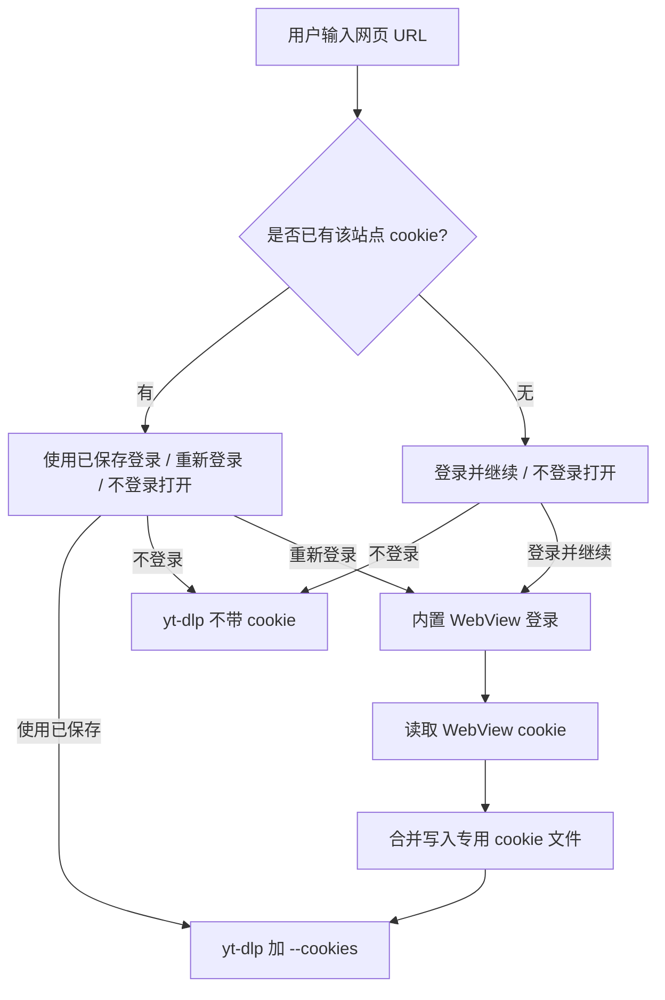

# FluxPlayer 网页视频播放技术方案

## 目标

用户输入任意网页 URL（B站、YouTube、抖音、优酷、爱奇艺等），FluxPlayer 自动识别、提取并播放其中的视频，体验与输入直链无异。

---

## 现状分析

### 已支持
- 直链视频文件（MP4/MKV/AVI 等 HTTP 直链）
- HLS 直播流（`.m3u8`）
- RTSP / RTMP 直播流
- FFmpeg 内置的所有网络协议

### 不支持
- 需要 JavaScript 渲染的网页（B站、YouTube 等）
- 需要登录鉴权的平台
- DASH 分离流（视频/音频分离，需合并）
- 带防盗链 headers 的流（需携带 Referer/Cookie）

### 核心约束
- 无 avfilter（CMakeLists.txt 未链接），无法用 FFmpeg 滤镜管线合并流
- URL 在整个链路中原样传递：`HomeScreen → main → Player::open → Demuxer::open → avformat_open_input`
- 无插件机制，扩展需直接修改源码

---

## 整体方案

```
用户输入 URL
     │
     ▼
┌─────────────────────────────┐
│     URL 分类器               │
│  直链/HLS/RTSP → 直接播放    │
│  网页 URL      → 提取器      │
└─────────────────────────────┘
     │ 网页 URL
     ▼
┌─────────────────────────────┐
│     StreamExtractor          │
│  调用 yt-dlp 提取流信息       │
│  输出: StreamInfo            │
│    - title                   │
│    - videoUrl / audioUrl     │
│    - headers (Referer等)     │
│    - isDash                  │
└─────────────────────────────┘
     │
     ├─── 单一流 ──────────────────────────────────────────┐
     │                                                      ▼
     │                                          Demuxer::open(url, headers)
     │
     └─── DASH 分离流 ──────────────────────────────────────┐
                                                            ▼
                                              启动 ffmpeg 子进程合并
                                              video + audio → pipe
                                              Demuxer::open("pipe:0")
```

---

## 模块设计

### 1. StreamExtractor（新增）

**文件：**
- `include/FluxPlayer/utils/StreamExtractor.h`
- `src/utils/StreamExtractor.cpp`

```cpp
struct StreamInfo {
    std::string title;
    std::string videoUrl;
    std::string audioUrl;   // 空 = 单一流或无音频
    std::string headers;    // "Referer: xxx\r\nUser-Agent: xxx\r\n"
    bool isDash;
    int width, height;
};

class StreamExtractor {
public:
    // 检测是否需要提取（非直链 URL）
    static bool needsExtraction(const std::string& url);

    // 同步提取，在后台线程调用，超时 30s
    static bool extract(const std::string& pageUrl,
                        StreamInfo& out,
                        std::string& error);

    // 检测 yt-dlp 是否已安装
    static bool isYtDlpAvailable();
};
```

内部实现：
```bash
yt-dlp -j --no-playlist --no-warnings <url>
```
解析 JSON，优先取合并格式（`vcodec != none && acodec != none`），否则分别取最佳视频流和音频流。

**needsExtraction 判断逻辑：**
- 不含媒体扩展名（`.mp4/.m3u8/.flv` 等）
- 不以 `rtsp://` / `rtmp://` 开头
- 域名在已知平台列表中（bilibili.com、youtube.com、youtu.be、douyin.com、iqiyi.com、youku.com 等）
- 或：URL path 不含文件扩展名且域名非 CDN

---

### 2. DashMerger（新增）

**文件：**
- `include/FluxPlayer/utils/DashMerger.h`
- `src/utils/DashMerger.cpp`

负责启动 ffmpeg 子进程，将分离的视频/音频流合并为单一 MKV 流，通过匿名管道输出：

```cpp
class DashMerger {
public:
    // 启动合并进程，返回可读 fd（POSIX）或 HANDLE（Windows）
    // startSeconds > 0 时通过 FFmpeg "ss" 选项让上游用 HTTP Range 跳过前面数据
    // （DASH 流 seek 时复用此参数重启 merger，绕开 pipe 不可 seek 的限制）
    bool start(const std::string& videoUrl,
               const std::string& audioUrl,
               const std::string& headers,
               double startSeconds = 0.0);

    // 返回 Demuxer 可打开的 URL（"pipe:N" 或命名管道路径）
    std::string getPipeUrl() const;

    void stop();
    ~DashMerger();

private:
    pid_t ffmpegPid_ = -1;
    int pipeFd_ = -1;
};
```

ffmpeg 命令：
```bash
ffmpeg -loglevel quiet \
  -headers "<headers>" -i <videoUrl> \
  -headers "<headers>" -i <audioUrl> \
  -c copy -f matroska pipe:1
```

**DASH 流 seek 实现**：pipe 输入对 FFmpeg 不可 seek，matroska 流式生成时
也没有 cues 索引，传统 `demuxer_->seek` 必然失败（"Seek to desired resync
point failed"）。`Player::restartDashMerger(seekTime)` 通过停止旧 merger、
重启上游连接来实现真正的 seek：在两个 input 打开后调用
`av_seek_frame(ctx, -1, ts, AVSEEK_FLAG_BACKWARD)`，FFmpeg 内部利用源 m4s URL
的 HTTP Range 让服务端从目标位置开始返回数据。**输出 PTS 保留原始绝对时间**，
Player 时钟无需偏移修正。`processSeekRequest` 检测 `dashMerger_ != nullptr`
时分流到此路径，本地文件 / 普通直链仍走原 `demuxer_->seek`。

**连续 seek 与音频欠载处理**：进度条拖动释放、方向键连按等场景可能在上一次
DASH 冷启动尚未完成时产生新目标。实现采用 `latest-seek-wins`：每次 `postSeek`
递增 generation，`DashMerger` 的 FFmpeg interrupt callback 检测代号变化后立即中断
旧目标的 HTTP open/read，demux 线程只重启最后目标。视频/音频两路 `av_seek_frame`
并行执行，避免两次 Range 延迟串行叠加。重建期间暂停音频设备回调，第一帧新 serial
音频入队后再恢复，避免空队列持续累计 underrun 和旧 AClock 插值导致画面冻结。

**seek 稳定性优先**：分阶段日志表明主要耗时来自代理/CDN 的 HTTP open 与 Range seek。
曾尝试强制 `multiple_requests`、跳过 `find_stream_info`、并发首包预取和激进小 Cluster，
但 FFmpeg 4.4 经 CONNECT 代理时出现 `premature EOF`、`partial file/Packet corrupt`，收益
不足以覆盖稳定性风险，现已回退。当前保留安全的两路并行 open/Range seek、latest-seek-wins
和阶段耗时日志。新 seek 在独立候选 `DashMerger + Demuxer` 中完整准备，候选 pipe 可解析后
才事务式替换当前管线；候选准备期间 generation 可取消候选，但已提交的当前流不会被提前截断。
准备失败时旧管线保持完整，不打开空 pipe、不进入 ERROR，用户可再次 seek 重试。POSIX pipe
读端在 URL 交付时显式转移所有权，避免失败清理时重复 close 已被系统复用的 fd。

**延迟预算与失败回退**：连续 seek 先等待 300ms 静默期并合并为最后目标，避免日志中
一次拖动反复建立多组 TLS 连接。seek 候选的单路 open/rw 超时为 4s、Range seek 为 6s，
总预算 12s。每次候选内部启用 reconnect/network-error 重连且延迟上限 1s；不对 fMP4
启用 `reconnect_streamed`，避免代理 partial EOF 后从错误 offset 续读造成 atom/packet
损坏。已配置代理时首个候选走代理，失败后等待 150ms 改走直连；未配置代理时只尝试一次，
避免重复同一路由。候选 Matroska pipe 使用 `openSelfDescribingPipe`，只读取 EBML/Tracks 并
直接校验 codecpar，不运行 `find_stream_info` 的媒体包探测。稳定网络下主要耗时应收敛到一次
并行 open（约 1~2s）加一次并行 Range（约 2~4s）。

**为什么不用 `-ss` 选项**：`av_dict_set(opts, "ss", ...)` 在 `avformat_open_input`
之前注入等价于 ffmpeg CLI 的"input 前 -ss"，会重置输出 PTS 从 0 开始，
导致 AClock=132.8 但实际帧 PTS=0 → 进度条与画面错乱。必须用 input 打开后的
`av_seek_frame` 才能保留原 PTS。

---

### 3. Demuxer 改造

在 `Demuxer::open()` 入口增加 headers 支持：

```cpp
// 新增重载
bool Demuxer::open(const std::string& url, const std::string& httpHeaders);
```

在 `configureNetworkOptions()` 中，若 `httpHeaders` 非空，通过 `av_dict_set` 注入：
```cpp
av_dict_set(&options, "headers", httpHeaders.c_str(), 0);
```

---

### 4. Player 改造

`Player::open()` 增加提取流程：

```cpp
bool Player::open(const std::string& path) {
    std::string actualUrl = path;
    std::string headers;

    if (StreamExtractor::needsExtraction(path)) {
        setState(EXTRACTING);  // 新增状态，UI 显示"正在解析..."
        StreamInfo info;
        std::string error;
        if (!StreamExtractor::extract(path, info, error)) {
            setError(error);
            return false;
        }
        title_ = info.title;
        if (info.isDash) {
            dashMerger_ = std::make_unique<DashMerger>();
            dashMerger_->start(info.videoUrl, info.audioUrl, info.headers);
            actualUrl = dashMerger_->getPipeUrl();
        } else {
            actualUrl = info.videoUrl;
            headers = info.headers;
        }
    }

    // 原有流程
    demuxer_->open(actualUrl, headers);
    ...
}
```

---

### 5. HomeScreen 改造

- URL 输入框下方增加状态行：`正在解析...` / `解析失败: <error>`
- 检测到 yt-dlp 未安装时，显示安装提示
- 支持从剪贴板粘贴 URL（ImGui 已内置 Ctrl+V）

---

### 6. PlayerState 新增状态

```cpp
enum class PlayerState {
    IDLE,
    EXTRACTING,  // 新增：正在通过 yt-dlp 提取流信息
    OPENING,
    PLAYING,
    PAUSED,
    STOPPED,
    ERRORED
};
```

---

## UI 风格规范

所有新增 UI 元素必须与现有赛博朋克风格一致，参考 `HomeScreen.cpp` 的实现。

### 色彩规范

| 用途 | 颜色 | ImVec4 |
|------|------|--------|
| 主色（蓝） | `#00BFFF` | `(0.00, 0.75, 1.00, *)` |
| 强调色（紫） | `#BF00FF` | `(0.75, 0.00, 1.00, *)` |
| 背景 | `#0A0A14` | `(0.04, 0.04, 0.08, *)` |
| 文字 | 冷白 | `(0.88, 0.95, 1.00, 1.00)` |
| 禁用文字 | 暗蓝灰 | `(0.30, 0.40, 0.55, 1.00)` |
| 成功/进度 | 蓝色发光 | 主色 + `AddShadowRect` |
| 错误 | 红紫 | `(1.00, 0.20, 0.40, *)` |

### 各新增元素的风格要求

**HomeScreen 状态行（"正在解析..." / 错误提示）**
- 文字颜色：解析中用主色蓝，错误用红紫
- 前缀加 `▶` 或 `✕` 符号
- 用 `AddRectFilledMultiColor` 绘制左侧渐变色条（宽 3px）

**Controller 画质按钮**
- 透明底 + 主色蓝边框（`ImGuiCol_Border`）
- Hover 时边框亮度提升，背景加 12% 蓝色填充
- 当前画质标签用主色蓝文字，其他用暗蓝灰
- Popup 菜单用 L 形角装饰（复用 `drawCyberCorners`）

**Controller 下载按钮**
- 与现有工具栏按钮风格一致（透明底 + 边框发光）
- 下载进度条：用 `AddRectFilledMultiColor` 蓝→紫渐变填充

**yt-dlp 未安装提示**
- 卡片式弹窗，四角 L 形装饰
- 顶部渐变色条（蓝→紫）
- 安装命令用等宽字体 + 暗背景框显示

---


| 文件 | 类型 | 改动说明 |
|------|------|----------|
| `include/FluxPlayer/utils/StreamExtractor.h` | 新增 | 流提取接口 |
| `src/utils/StreamExtractor.cpp` | 新增 | yt-dlp 调用 + JSON 解析 |
| `include/FluxPlayer/utils/DashMerger.h` | 新增 | DASH 合并接口 |
| `src/utils/DashMerger.cpp` | 新增 | ffmpeg 子进程管理 |
| `include/FluxPlayer/core/Player.h` | 修改 | 新增 EXTRACTING 状态、dashMerger_ 成员 |
| `src/core/Player.cpp` | 修改 | open() 加提取流程 |
| `include/FluxPlayer/decoder/Demuxer.h` | 修改 | open() 新增 headers 参数 |
| `src/decoder/Demuxer.cpp` | 修改 | configureNetworkOptions() 注入 headers |
| `src/ui/HomeScreen.cpp` | 修改 | 状态提示 + yt-dlp 安装检测 |
| `CMakeLists.txt` | 无需修改 | 无新依赖 |

---

## 依赖

| 依赖 | 用途 | 安装方式 |
|------|------|----------|
| `yt-dlp` | 提取网页视频流信息 | `brew install yt-dlp` |
| `ffmpeg` CLI | DASH 流合并 | 已随 FFmpeg 库安装 |

两者均为运行时依赖，不影响编译。未安装时降级处理（显示提示，不崩溃）。

---

## 平台支持

| 平台 | DASH 合并 | 管道方式 |
|------|-----------|----------|
| macOS | 支持 | `pipe(2)` + fd 传递 |
| Windows | 支持 | 命名管道 `\\.\pipe\fluxplayer_dash` |
| Linux | 支持 | `pipe(2)` + fd 传递 |

---

## Seek 与倍速支持

### 现有实现
- `Player::seek(double seconds)`：非直播流正常 seek，直播流跳过
- `Player::setPlaybackSpeed(double speed)`：通过 `playbackRate_` 控制，音频用 swresample 变速，视频丢帧追赶
- `isLiveStream()` 判断依据：`duration == AV_NOPTS_VALUE` 或 `<= 0`

### HTTP VOD 与直播判定

HTTP/HTTPS 只描述传输协议，不代表直播。普通 MP4/MOV 渐进式点播即使来自 CDN，
只要容器报告有限 `duration`，就必须按 VOD 处理并允许 `Demuxer::seek()`。只有以下证据
才进入 Live：

- duration 无效，且输入持续等待服务端生成未来数据；
- HLS/DASH manifest 明确为动态直播；
- URL/容器明确属于 RTSP、RTMP、RTP 等实时协议。

不能使用 `isNetworkUrl(url)` 作为 Live 判据；否则所有 HTTP MP4 都会被禁用 seek，且错误
注入 `rtsp_transport`、`rtmp_live=live`，EOF 还会误走直播重连而不是正常播放结束。

HTTP VOD 打开时若启用了配置代理，单次代理 I/O 最长等待 5s，失败后立即直连重试一次；
不在失效代理上执行指数退避，避免本可直连的 CDN MP4 因代理瞬时错误完全打不开。

HTTP VOD 读到 EOF 后按普通点播停泊：投递 null packet、drain 解码器并等待用户 seek；
seek 时先暂停音频设备，同时清空 audio/video frame queue 与 packet queue（packet flush 推进
serial），将 AVSync 与 UI 位置立即校准到目标。音频门控独立于视频的
`decodingToTarget`：持续丢弃目标前音频，只有目标后的帧完成 S16 转换并实际入队后才恢复
设备；恢复前先把 AClock 基准校准到该帧 PTS。seek 另外维护独立的 video/audio aligned
标志：两路未全部对齐前，`Player::getCurrentTime()` 固定使用 seek 目标或已渲染视频 PTS，
不允许尚未提交的 AClock 接管 UI。目标音频入队只负责恢复设备，只有音频设备回调真正消费
新帧并提交新 AClock 后才发布 audio-aligned；两路均 ready 后才恢复音频主时钟。音频回调与 seek
flush 由互斥屏障串行化，并允许 seek 后第一批音频合法向后重定位 AClock。`postSeek`
在 `seekMutex` 内原子发布 pending、推进 packet serial 并清空 frame queue，避免旧 packet
获得新 serial 或新位置 packet 被随后 flush。Demuxer 未发布 ready 前，DecodeWorker 还会
直接丢弃所有残留音视频输出，防止旧帧提前解除门控。精确解码超时按
来源区分：本地文件 2s，HTTP/网络 VOD 8s；`Demuxer::seek()` 成功后重置计时窗口，CDN
Range 等待不占用解码预算。HTTP reconnect 选项继续保留，通过服务端 Range 恢复，不启用
直播 PTS 归一化。

### 直播 PTS 连续化与卡顿治理

实时推流可能大量缺失视频 PTS，或在断续上传时让音频 PTS 每隔数秒前跳。若直接把前跳后的
AClock 作为主时钟，视频会集中消费积压帧，表现为“先卡住、再突然快进”。处理规则：

- 起播等待音视频首帧，取较晚者作为统一可播放基准，并丢弃首个视频 IDR 之前的旧音频；
- 视频缺失 PTS 时优先使用 packet DTS，仍缺失则按稳定帧间隔估算；
- 音频/视频原始时间戳跨域跳变时更新持久 correction，不只修正单帧，保证后续时间轴连续；
- 直播音频整份设备 buffer 欠载时才按输出时长推进 AClock，并同步 normalizer 音频时间轴；部分填充不重复计时；
- 无 PTS 或长期落后的有效视频 PTS 会锚定到连续音频时间轴附近，避免 VClock 永久停滞；
- 归一化输出（含估算/平滑帧）作为连续时间轴更新 VClock，视频队列短空时不再用 AClock 伪造 VClock；
- 网络恢复后视频落后主时钟超过 250ms 时丢弃积压帧，每个渲染 tick 最多处理 8 帧，只展示接近实时画面；
- Frame 的 estimated 元数据在 move/ref/unreference 生命周期完整重置，避免队列槽复用污染；
- 缺失 PTS 和 underrun 日志按周期节流，避免日志 I/O 反向放大实时播放抖动。

### DASH pipe 流的问题
通过 `pipe:` 打开的合并流，FFmpeg 无法从容器头读取 duration，导致 `isLiveStream()` 返回 true，seek 和倍速被禁用。

### 解决方案
yt-dlp JSON 中包含 `duration` 字段（单位：秒），在 `DashMerger` 启动后、`Demuxer::open()` 返回前，手动注入 duration：

```cpp
// Demuxer::open() 中，avformat_open_input 成功后
if (knownDuration > 0) {
    m_formatCtx->duration = static_cast<int64_t>(knownDuration * AV_TIME_BASE);
}
```

`StreamInfo` 新增 `duration` 字段，由 `StreamExtractor` 从 yt-dlp JSON 读取并传递给 `DashMerger` / `Demuxer`。

这样 DASH 流的 seek 和倍速行为与本地文件完全一致。

---

## 登录 Cookie 支持（会员内容）

### 目标

播放需要登录的网页视频时，避开"读用户本机浏览器 cookie 数据库"思路（在 Windows 上常因浏览器后台进程锁住 SQLite 而失败）。改为：

1. 用户输入网页视频 URL 后，主界面询问"登录并继续 / 不登录打开 / 使用已保存登录"
2. 选择登录时弹出**内置浏览器登录窗口**（macOS 用 WKWebView，Windows 用 WebView2）
3. 用户在内置窗口内完成登录后，程序读取浏览器内核 cookie，写入专用 cookie 文件
4. yt-dlp 通过 `--cookies <专用 cookie 文件>` 提取
5. 不登录时不带 cookie，按公开内容方式提取



### 模块划分

| 模块 | 文件 | 职责 |
|------|------|------|
| `CookieStore` | `include/FluxPlayer/utils/CookieStore.h` `src/utils/CookieStore.cpp` | 维护 Netscape 格式 cookie 文件，按 (domain, path, name) 合并去重，过期自动清理 |
| `WebLogin` | `include/FluxPlayer/utils/WebLogin.h` `src/utils/WebLogin_mac.mm` `src/utils/WebLogin_win.cpp` | 弹出原生登录窗口、读取浏览器内核 cookie |
| `StreamExtractor` | `src/utils/StreamExtractor.cpp` | 调用 yt-dlp 时按 URL 命中 CookieStore 决定是否传 `--cookies` |
| `HomeScreen` | `src/ui/HomeScreen.cpp` | 提交 URL 后弹出登录询问对话框 |

### Cookie 文件设计

#### 路径

cookie 文件由程序统一维护，固定在 `fluxplayer.ini` 同目录下：

```text
<fluxplayer.ini 所在目录>/cookies/web_cookies.txt

Windows: %LOCALAPPDATA%\FluxPlayer\cookies\web_cookies.txt
macOS:   ~/Library/Caches/FluxPlayer/cookies/web_cookies.txt
Linux:   ~/.cache/FluxPlayer/cookies/web_cookies.txt
```

不暴露给用户配置，避免误改。CookieStore 通过 `Config::getAppDataDir()` 复用配置目录。

#### 文件格式

yt-dlp / curl 兼容的 Netscape cookies 格式：

```text
# Netscape HTTP Cookie File
# This file is generated by FluxPlayer. Do not edit manually.
.bilibili.com   TRUE  /  TRUE   1767225600  SESSDATA    xxxx
#HttpOnly_.bilibili.com  TRUE  /  TRUE   1767225600  bili_jct  xxxx
```

字段顺序：`domain  include_subdomains  path  secure  expires  name  value`，HttpOnly 行加 `#HttpOnly_` 前缀。

#### 维护规则

- 唯一键：`(domain, path, name)`，重复写入覆盖
- session cookie：`expires` 写 `0`
- 过期 cookie：保存前自动清理（`expires > 0 && expires < now()` 视为过期）
- 写入由 `CookieStore::mergeCookies(...)` 完成，全程持有全局 mutex
- 读取由 `CookieStore::hasCookiesForUrl(url)` 完成，主机名匹配规则：
  - `www.bilibili.com` 匹配 `domain == "www.bilibili.com"` 或 `domain == ".bilibili.com"`（含子域）

### 内置登录窗口

#### 跨平台实现

| 平台 | 浏览器内核 | Cookie 读取 API |
|------|-----------|-----------------|
| Windows | Microsoft WebView2 | `ICoreWebView2CookieManager::GetCookies` |
| macOS | WKWebView | `WKHTTPCookieStore.getAllCookies` |
| Linux | 占位 | 返回 `Unsupported` |

`WebLogin` 接口对外纯 C++（仅暴露 `std::string` / `std::vector<NetscapeCookie>`），平台桥接代码隔离在 `_mac.mm` / `_win.cpp` 内部。

#### Windows: WebView2

依赖 WebView2 Runtime（Win10 21H1+ / Win11 已预装；旧系统通过 Edge 安装即可）。

**额外需要的“第三方文件”只有一个头文件 `WebView2.h`**——和 macOS 调用 `WebKit.framework` 性质等价（系统组件 + 微软官方头），仅是分发约定不同：

```text
third_party/webview2/include/WebView2.h    ← 唯一需要放置的文件
```

构建系统检测到 `WebView2.h` 后定义 `FLUXPLAYER_HAVE_WEBVIEW2`，启用真实实现；缺失时编译为占位（运行时返回 `Unsupported`），保证构建始终成功。

实现层面也做了进一步去依赖：

| 通常做法 | 本项目做法 | 收益 |
|---------|-----------|------|
| 链接 `WebView2LoaderStatic.lib` | `LoadLibraryW(L"WebView2Loader.dll")` 动态加载入口函数 | 构建时不需要 .lib，运行时由 WebView2 Runtime 提供 DLL |
| 使用 `<wil/com.h>`（Windows Implementation Library） | 仅使用 Windows SDK 自带的 `<wrl/client.h>` + `<wrl/event.h>` | 不引入任何第三方 C++ 库 |

异步流程：
1. `LoadLibraryW(L"WebView2Loader.dll")` + `GetProcAddress("CreateCoreWebView2EnvironmentWithOptions")`
2. 调用入口函数创建环境
3. `CreateCoreWebView2Controller` 在登录窗口 HWND 上创建控制器
4. `Navigate(<URL>)` 加载用户输入的 URL
5. 用户点击「完成登录」→ `ICoreWebView2_2::get_CookieManager` 异步取所有 cookies
6. 回调内 `PostMessage(WM_FP_QUIT_LOGIN)` 通知主流程退出消息泵

#### macOS: WKWebView

直接使用系统 `WebKit.framework`，无外部依赖。`WebLogin_mac.mm` 是 Objective-C++ 实现，构建系统已编译 GLFW 的 `.m` 文件，新增 `.mm` 不增加编译复杂度。

异步流程：
1. 创建 `NSWindow` + `WKWebView`，加载 URL
2. `[NSApp runModalForWindow:]` 阻塞主线程进入模态
3. 用户点击「完成登录」→ `WKHTTPCookieStore.getAllCookies` 异步取 cookies
4. 回调内 `[NSApp stopModalWithCode:]` 退出模态
5. 模态期间主线程 RunLoop 仍在跑（不能用 semaphore 阻塞），cookies 取完才退出

#### Cookie 域过滤

读取的 cookies 按用户访问 URL 的主机名过滤：仅保留 host 命中的（含通配子域），避免把整个浏览器 cookie 集合写到文件里。

### yt-dlp 调用

```cpp
// StreamExtractor.cpp
std::string StreamExtractor::prepareCookieArgForUrl(const std::string& pageUrl) {
    if (pageUrl.empty()) return "";
    if (!CookieStore::hasCookiesForUrl(pageUrl)) return "";
    return " --cookies \"" + CookieStore::getCookieFilePath() + "\"";
}
```

不再调用：
- `--cookies-from-browser edge`
- `--cookies-from-browser chrome`

继续保留浏览器请求伪装：

```text
--impersonate edge-101:windows-10
```

### 失败处理

| 情况 | 行为 |
|------|------|
| 用户取消登录 | 留在 HomeScreen，不进入播放 |
| 登录后未读到 cookie | 提示并按无 cookie 方式打开 |
| cookie 文件存在但 yt-dlp 仍失败 | 自动降级为无 cookie 重试一次 |
| Windows 缺少 WebView2 SDK | 编译为占位实现，运行时显示「未启用 WebView2 SDK」 |
| DRM 内容 | 不属本方案范围（cookie 只解决登录态，不解决 DRM 解密） |

### 安全策略

- cookie 文件不进入项目仓库（位于 `getAppDataDir()` 下，不在工作树内）
- 日志只记录命中数量、是否存在，不打印 cookie name / value
- 后续可升级为平台加密存储（Windows DPAPI / macOS Keychain），调用 yt-dlp 前再导出 Netscape 临时文件

---

## 画质选择

### 方案

yt-dlp JSON 中 `formats` 数组包含所有可用画质，每条记录含 `format_id`、`height`、`vcodec`、`filesize` 等字段。

### 流程

```
StreamExtractor::extract() 时同时提取所有可用画质列表
    │
    ▼
Player 开始播放后，Controller 工具栏显示当前画质（如 "1080P"）
    │
    ▼
用户点击画质按钮 → 弹出画质菜单（360P / 480P / 720P / 1080P / 4K）
    │
    ▼
选择新画质 → 记录当前播放位置 currentTime
    │
    ▼
重新调用 StreamExtractor::extract(pageUrl, selectedFormatId)
    │
    ▼
Player::open(newUrl) + seek(currentTime)  ← 无缝切换，保持播放位置
```

### StreamInfo 扩展

```cpp
struct QualityOption {
    std::string formatId;   // yt-dlp format_id，传给 -f 参数
    int height;             // 360 / 480 / 720 / 1080 / 2160
    std::string label;      // "1080P" / "4K" 等显示名
    int64_t filesize;       // 字节，-1 表示未知
};

struct StreamInfo {
    // ... 原有字段 ...
    std::vector<QualityOption> qualities;  // 新增：所有可用画质
    std::string selectedFormatId;          // 当前选中的 format_id
};
```

### yt-dlp 调用

提取时加 `-f <formatId>` 指定画质：

```cpp
// 首次提取：不指定 format，取默认最佳画质并返回所有可用画质列表
// 切换画质：指定 formatId，重新提取对应流 URL
cmd.push_back("-f");
cmd.push_back(formatId.empty() ? "bestvideo[vcodec^=avc1]+bestaudio/bestvideo+bestaudio/best" : formatId);
```

### 画质去重策略

YouTube `formats` 数组中同一分辨率存在多种编码（AV1、VP9、H.264），且 AV1/VP9 排在前面。`parseQualities` 去重时优先保留 H.264（`vcodec` 以 `avc1` 开头）：

- 同分辨率首次出现：直接加入列表
- 同分辨率已存在非 H.264：若新条目是 H.264，则替换

这与初次提取的 `bestvideo[vcodec^=avc1]` 策略一致，确保切换画质时 formatId 对应的是 H.264 流，避免 FFmpeg 解码 AV1/VP9 失败或回退到低画质。

### UI

Controller 工具栏右侧新增画质标签按钮，播放网页视频时显示，本地文件时隐藏。点击弹出 ImGui Popup 列表，当前画质高亮显示。

### 改动文件

| 文件 | 改动 |
|------|------|
| `include/FluxPlayer/utils/StreamExtractor.h` | `StreamInfo` 新增 `qualities` 字段 |
| `src/utils/StreamExtractor.cpp` | 解析所有 formats，支持 `-f formatId` 参数 |
| `src/core/Player.h/cpp` | 新增 `switchQuality(formatId)` 方法 |
| `src/ui/Controller.cpp` | 新增画质按钮 + Popup 菜单 |

---


- 需要登录才能播放的内容（大会员视频等）需用户提供 cookies（`yt-dlp --cookies-from-browser chrome`，后续版本支持）
- 直播类网页 URL（B站直播间）需额外处理，yt-dlp 对直播支持有限
- yt-dlp 提取耗时约 2-5 秒，期间 UI 显示加载状态

---

## 网络代理支持

### 背景

YouTube 等境外流媒体在国内无法直连（`googlevideo.com` 被墙），DashMerger 和 Demuxer 通过 FFmpeg 打开 HTTP/HTTPS 流时需要走代理。

### 实现

通过 FFmpeg 的 `http_proxy` 选项注入代理，在 `avformat_open_input` 之前设置：

```cpp
av_dict_set(&options, "http_proxy", cfg.httpProxy.c_str(), 0);
```

注入位置：
- `Demuxer::configureNetworkOptions()` — 所有 HTTP/HTTPS 流自动走代理
- `DashMerger::mergeLoop()` — 视频流和音频流打开时均注入代理
- `StreamExtractor::extract()` — yt-dlp 提取流信息时加 `--proxy` 参数（含 cookie 降级重试路径）
- `Downloader::downloadLoop()` — FFmpeg API 打开网络流时注入 `http_proxy` 选项

### 配置项（fluxplayer.ini）

```ini
[Proxy]
# 说明：是否启用网络代理（用于访问需要代理的流媒体，如 YouTube）
# 取值：true / false
# 默认：true
proxyEnabled=true
# 说明：HTTP/HTTPS 代理地址，FFmpeg 打开 http/https 流时使用
# 取值：完整代理 URL
# 默认：http://127.0.0.1:7890
httpProxy=http://127.0.0.1:7890
# 说明：SOCKS5 代理地址（备用，部分协议可能使用）
# 取值：完整代理 URL
# 默认：socks5://127.0.0.1:7890
socksProxy=socks5://127.0.0.1:7890
```

等效于环境变量：`export https_proxy=http://127.0.0.1:7890 http_proxy=http://127.0.0.1:7890 all_proxy=socks5://127.0.0.1:7890`

### 注意事项

- FFmpeg 的 `http_proxy` 仅对 HTTP/HTTPS 协议生效，RTSP/RTMP 不走此代理
- 代理开关支持热重载，修改配置文件后切换界面即生效
- `proxyEnabled=false` 时完全不注入代理，适合直连环境

---

## 下载功能

### 方案

用 FFmpeg API 直接读取 StreamExtractor 提取到的流 URL，逐 packet 写入本地文件。不依赖 ffmpeg.exe CLI 工具，复用项目已集成的 FFmpeg 库。

**流程：**
1. `StreamExtractor::extract()` 获取流 URL（按画质高度筛选最佳格式）
2. `avformat_open_input()` 打开视频/音频流（注入 headers、代理、interrupt_callback）
3. `avformat_alloc_output_context2()` + `avio_open()` 创建输出文件
4. 逐 packet 读取并写入（DASH 双流按 DTS 交织合并，HLS 单流直写）
5. 通过码率估算总大小，每 0.5 秒回调进度

**画质选择：** Controller 在触发下载时从当前画质标签提取高度（如 "1080P" → "1080"），传给 Downloader。Downloader 内部调用 `StreamExtractor::extract()` 获取格式列表，找到最接近目标高度的格式重新提取 URL。下载途中切换播放画质不影响正在进行的下载。

### Downloader 类

**文件：** `include/FluxPlayer/utils/Downloader.h` / `src/utils/Downloader.cpp`

```cpp
class Downloader {
public:
    using ProgressCallback = std::function<void(float progress,
                                                 const std::string& speed,
                                                 const std::string& eta,
                                                 const std::string& fileSize)>;
    using FinishCallback = std::function<void(bool ok,
                                              const std::string& path,
                                              const std::string& error)>;

    void start(const std::string& pageUrl, const std::string& outputDir,
               const std::string& formatId, ProgressCallback, FinishCallback);
    void pause();   // 原子标志，写入循环中 sleep 等待
    void resume();
    void cancel();  // interrupt_callback 中断网络 I/O，退出后删除未完成文件
};
```

**暂停/恢复：** 原子标志 `paused_`，写入循环中检查并 sleep，同时刷新 interrupt_callback deadline 避免超时断连。

**取消：** 原子标志 `cancelled_`，interrupt_callback 返回 1 中断 `av_read_frame()`，退出循环后删除输出文件。

### UI 入口

播放器 Controller 工具栏新增"下载"按钮，仅当 `lastPageUrl_` 非空（即当前播放内容来自网页 URL）时显示。点击后弹出系统文件夹选择对话框，确认后启动下载，底部状态栏显示进度条。

### 改动文件

| 文件 | 改动 |
|------|------|
| `include/FluxPlayer/utils/Downloader.h` | 新增 |
| `src/utils/Downloader.cpp` | 新增 |
| `src/ui/Controller.cpp` | 新增下载按钮 + 进度条 |
| `src/core/Player.h/cpp` | 新增 `lastPageUrl_` 字段 |

---
